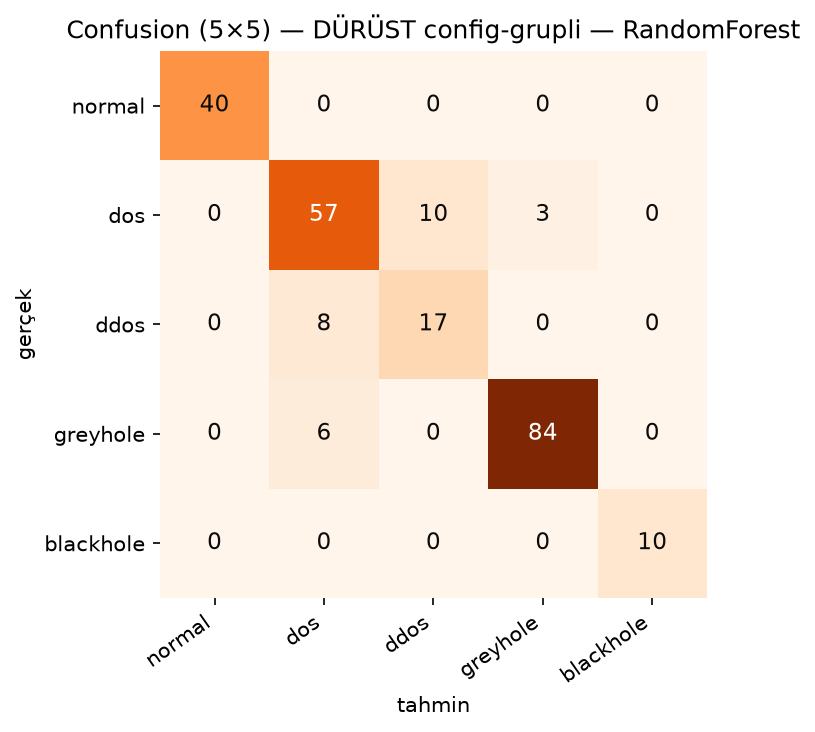
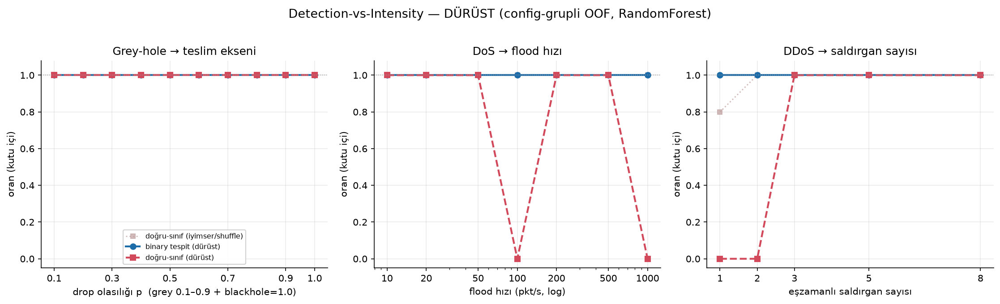
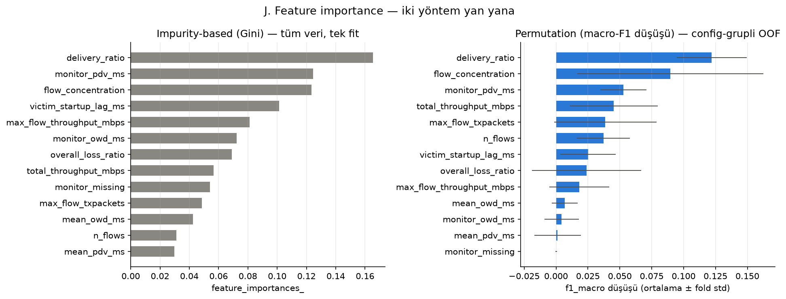
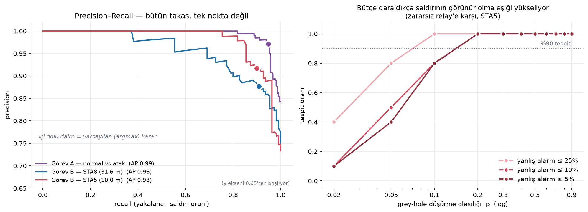
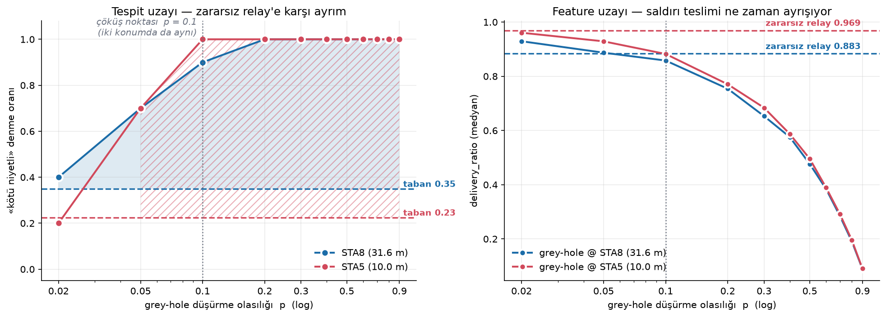
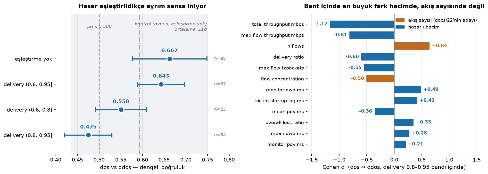
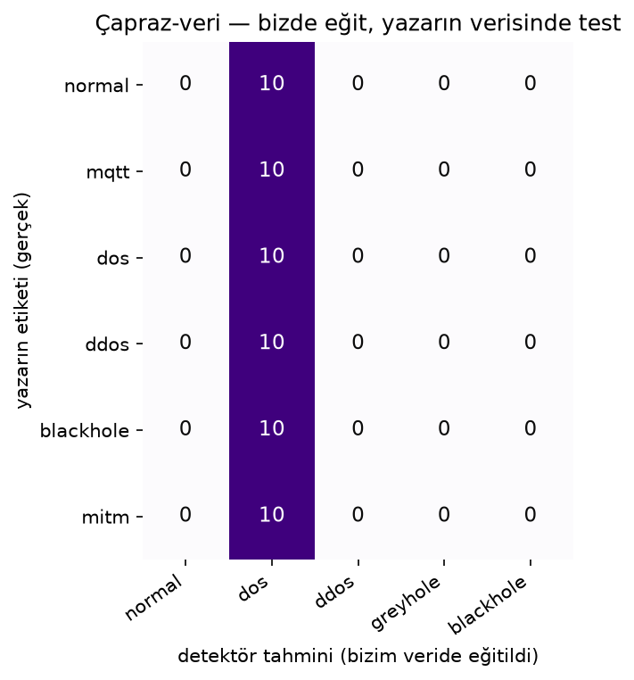

# IoMT Ağlarında Saldırı Tespiti: Simülasyon, Veri Seti ve Makine Öğrenmesi Detektörü

**Yazar:** Okan Koca
**Tarih:** Temmuz 2026
**Kod ve veri:** `github.com/<kullanıcı>/IoMT-NetworkAttackScenarios18`, sürüm `v1.1`

---

## Özet

Bir tıbbi cihazın hasta verisini kablosuz ağ üzerinden bir monitöre akıttığı ortamda, aynı ağ
üzerindeki bir saldırganın bu akışı bozması ya da değiştirmesi mümkündür. Bu çalışma, böyle bir
ortamı NS-3 ağ simülatöründe kurar, normal ve saldırı altındaki trafiği etiketli bir veri
setine dönüştürür, ve bu veriden hem "saldırı var mı" hem "hangi saldırı" sorularını yanıtlayan
bir makine öğrenmesi detektörü eğitir. Çalışma, DoS, DDoS, MITM, Blackhole ve MQTT-flood
saldırılarını simüle eden mevcut bir NS-3 çalışmasının üzerine kurulmuştur (Zenodo:
`10.5281/zenodo.16747386`) ve ona bir de **yeni, sessiz bir saldırı** ekler.

Üretilen veri seti **285 simülasyon koşusu** içerir; her koşu beş sınıftan birine aittir
(`normal`, `dos`, `ddos`, `greyhole`, `blackhole`) ve koşu başına 13 sayısal özellikle
temsil edilir. Aynı saldırı ayarının bütün koşularını eğitim ve test kümesinin **tek bir
tarafında** tutan, dolayısıyla modeli daha önce hiç görmediği bir saldırı şiddetiyle sınayan
bir değerlendirme altında (*grouped split*, §5.2) detektörün çok-sınıflı makro-F1 skoru
**0.788 ± 0.094**: ikili (saldırı var/yok) F1 skoru **0.960**'tır.
Yeni saldırı olarak seçilen **grey-hole (seçici iletmeme)** güvenilir biçimde tanınmaktadır
(F1 **0.958**). Buna karşılık `dos` ve `ddos` sınıfları birbirine karışmaktadır (F1 0.676 /
0.600) ve bu raporun bir bölümü bunun neden bir eğitim eksikliği değil, ölçüm tasarımının
yapısal bir sonucu olduğunu göstermeye ayrılmıştır.

Çalışmanın asıl bulgusu bir skor değildir. Saldırganı ağ yoluna gerçekten yerleştiren bir
kontrol deneyi, **hiçbir şey yapmayan** (tek bir paket bile düşürmeyen) bir aracı düğümün
tek başına detektörü %97.5 oranında alarma geçirdiğini göstermektedir. Yani detektörün
saldırıyı tespit ettiği sanılan yerde ölçtüğü şey büyük ölçüde **saldırının kendisi değil,
ağ yolunda fazladan bir aracının bulunmasıdır**. Aynı desen üç yerde birden tekrar eder ve
raporun §8'i bu desenin kendisini konu alır.

---

## Bu belge nasıl okunur

Bölüm sırası bağımlılığı izler: simüle edilen ağ, ölçülen büyüklükler, veri seti, model.
Her bölüm bir açılış paragrafıyla başlar; yalnızca o paragrafları okuyan biri de çalışmayı
takip edebilir.

**Terimler.** Bu alanın terimlerinin çoğunun yerleşmiş bir Türkçe karşılığı yoktur ve zorlama
çeviriler anlamı kapatır: "konfigürasyon-grupli bölme" gibi bir ifade, konuyu bilmeyen okura
hiçbir şey söylemez, bilen okuru İngilizce aslını tahmin etmeye zorlar. İzlenen kural:

- Yerleşik bir Türkçe karşılığı olan terimler Türkçe kullanılır, **ilk geçtikleri yerde
  İngilizce aslı parantez içinde** verilir: teslim oranı (*delivery ratio*), tıkanıklık
  (*congestion*), yol kaybı (*path loss*).
- Karşılığı yerleşmemiş ya da çevirisi anlamı bozan terimler **İngilizce bırakılır** ve ilk
  geçtikleri yerde bir cümleyle tanımlanır: *throughput*, *jitter*, *flow*, *grey-hole*,
  *grouped split*, *domain shift*.
- Kod ve veri adları (`delivery_ratio`, `n_flows`) hiçbir zaman çevrilmez; bunlar birer
  değişken adıdır, terim değil.

Terimlerin tamamı **Ek A**'da bir arada tanımlanmıştır.

Raporda geçen her sayısal sonuç tek bir kaynaktan üretilmiştir (`my-work/report_numbers.py`
→ `report_numbers.json`), elle kopyalanmamıştır. Gerekçesi §10'dadır.

---

## 1. Giriş

### 1.1 Problem

**IoMT (Internet of Medical Things)**: hastanelerde ve evde bakımda kullanılan, ölçtüğü veriyi
bir ağ üzerinden başka bir yere gönderen tıbbi cihazların ortak adıdır: infüzyon pompaları,
hasta başı monitörleri, giyilebilir EKG ve solunum sensörleri. Bu cihazların ortak özelliği,
ürettikleri verinin **zamanında ve değişmeden** ulaşmasının klinik bir gereklilik olmasıdır.
Gecikmiş ya da eksik bir ölçüm, yalnızca bir veri kaybı değil, yanlış bir klinik karara
dayanak olabilir.

Bu cihazlar aynı zamanda savunması en zayıf ağ bileşenleridir. Çoğu sınırlı işlemci ve
bellekle çalışır, güncelleme alması üreticiye ve hastane prosedürlerine bağlıdır, ve klinik
sertifikasyon süreçleri nedeniyle yazılımlarına müdahale edilmesi kolay değildir. Yani
korumayı **cihazın içine** koymak çoğu durumda mümkün değildir.

Bu, savunmayı doğal olarak **ağ tarafına** taşır. Cihazlara dokunulamıyorsa, cihazların
ürettiği trafik tek bir noktadan gözlenebilir ve trafiğin kendisindeki bozulmadan saldırının
varlığı çıkarılabilir. Bu çalışmanın konusu tam olarak budur: **ağ trafiğinin ölçülebilir
özelliklerinden saldırı tespiti.**

### 1.2 Neden simülasyon

Gerçek bir hastane ağında kontrollü saldırı denemesi yapmak mümkün değildir; hem hasta
güvenliği hem de etik ve yasal kısıtlar bunu engeller. Ayrıca makine öğrenmesi için gerekli
olan şey yalnızca "saldırı altındaki trafik" değil, **etiketli** ve **tekrarlanabilir**
trafiktir: hangi koşunun hangi saldırıyı, hangi şiddette içerdiğinin kesin olarak bilinmesi
gerekir. Gerçek bir ortamda bu etiket ancak varsayımla üretilebilir.

Bu nedenle çalışma **NS-3** ağ simülatörü üzerinde yürütülmüştür. NS-3, paket seviyesinde
ayrıklı-olay simülasyonu yapan, akademik olarak yerleşik açık kaynaklı bir simülatördür;
Wi-Fi fiziksel katmanını, MAC kuyruklarını ve yönlendirmeyi ayrı ayrı modeller. Simülasyonun
karşılığında verdiği şey, bir gerçek ölçümün asla veremeyeceği iki şeydir: **her koşunun
etiketi kesindir** ve **her koşu tohum (seed) verilerek birebir tekrar üretilebilir**.

Karşılığında ödenen bedel de açıktır ve bu rapor onu saklamaz: simülasyon, gerçek bir hastane
ağının bütün karmaşıklığını içermez. Bunun sonuçlarımızı nasıl sınırladığı §9'da ayrıntısıyla
tartışılmaktadır.

### 1.3 Ne yapılması istendi

Çalışmanın dört teslim edilebilir çıktısı vardır:

1. Mevcut bir saldırı senaryosunu yeniden üreten, çalışır bir NS-3 kurulumu.
2. Simülasyonlardan çıkarılmış, **etiketli bir ağ trafiği veri seti** (normal + saldırılar).
3. Saldırı olup olmadığını işaretleyen ve **saldırı tipini** belirleyen bir makine öğrenmesi
   detektörü; yanında **tespit–saldırı şiddeti eğrisi**.
4. Kaynak çalışmada bulunmayan, **yeni ve sessiz bir saldırının** NS-3'te gerçeklenmesi ve
   detektöre karşı sınanması.

### 1.4 Ne yapıldı — sonuçların özeti

Dördü de üretilmiştir. Kısaca:

- **Simülasyon tabanı.** Kaynak çalışmanın senaryo dosyaları temel alınmış, ancak
  doğrulandıktan sonra **yeniden yazılmıştır**, nedeni §2'de ayrıntısıyla verilen ampirik bir
  bulgudur: dosyaların üçünde saldırı fiilen gerçekleşmemektedir. Ayrıca senaryolara komut
  satırı parametreleri ve tohum yönetimi eklenmiş, ölçülebilir bir taban gürültüsü
  kalibre edilmiştir (§3).
- **Veri seti.** 285 koşu, 5 sınıf, koşu başına 13 model girdisi. Sınıf dağılımı:
  `greyhole` 110, `dos` 100, `normal` 40, `ddos` 25, `blackhole` 10 (§4).
- **Detektör.** Tek bir çok-sınıflı Random Forest. Dürüst değerlendirme (*grouped
  cross-validation*, §5.2) altında makro-F1 **0.788 ± 0.094**; ikili görünümde saldırı-F1
  **0.960**, yanlış alarm oranı **0.150**. Sınıf bazında: `greyhole` 0.958, `blackhole` 0.952,
  `normal` 0.800, `dos` 0.676, `ddos` 0.600 (§5, §6).
- **Yeni saldırı.** Ağ yoluna gerçekten yerleşen, paketleri `p` olasılığıyla düşüren bir
  **grey-hole** relay'i gerçeklenmiştir. `p` doğal bir şiddet ekseni verir ve tespit–şiddet
  eğrisi bunun üzerine kurulmuştur. İkinci bir saldırı, paketleri düşürmeyip **geciktiren**
  bir *timing-MITM*, de gerçeklenmiş, fakat sınıf olarak modele dahil edilmemiştir; sebebi
  bir başarısızlık değil, ölçüm katmanının yapısal bir körlüğüdür ve kendi başına bir bulgudur
  (§7).

### 1.5 Raporun asıl iddiası

Raporun iddiası yüksek bir skor elde edildiği değildir. Yukarıdaki skorların her biri, **ne
ölçtükleri sorulduğunda** farklı bir anlam kazanmaktadır.

Merkezdeki kontrol deneyi şudur: ağ yoluna yerleştirilmiş ama **hiçbir zararlı davranışı
olmayan** bir aracı düğüm, detektörü 40 koşunun **39'unda** alarma geçirmektedir. Yani
"saldırı tespit edildi" çıktısının büyük kısmı saldırıdan değil, **ağ yolunda fazladan bir
düğüm bulunmasından** gelmektedir.

Aynı desen bağımsız olarak üç kez ortaya çıkmaktadır; ortak açıklaması, akış seviyesinde
ölçülen özet büyüklüklerin **saldırganın niyetini değil kullandığı mekanizmayı** görmesidir.
Üçü §8'de bir aradadır.

---

## 2. Dayanak çalışma ve doğrulanması

> Senaryoların yeniden yazılması bir tercih değil, bir ölçümün sonucudur: koşulabilen dört
> saldırıdan üçü ağı fiilen değiştirmemektedir. Kaynağın yayımlanmış ölçüm çıktıları da aynı
> sebeple bir karşılaştırma ölçütü olarak kullanılamamaktadır.

### 2.1 Kaynak çalışma

Bu çalışma, **`ramamr33/IoMT-NetworkAttackScenarios18`** adlı NS-3 tabanlı simülasyon
çalışmasının üzerine kurulmuştur (Zenodo DOI: **`10.5281/zenodo.16747386`**). Kaynak çalışma,
bir tıbbi IoT ağında beş saldırı senaryosu simüle eder, DoS, DDoS, MITM, Blackhole ve
MQTT-flood; her senaryo için NS-3'ün **FlowMonitor** modülüyle toplanmış ölçüm çıktıları
yayımlar.

Kaynaktan devralınan şey **simülasyon tabanının kendisidir**: ağ topolojisi (9 Wi-Fi istasyonu,
bir erişim noktası, bir giyilebilir sensör düğümü), 802.11n Wi-Fi yapılandırması, UDP tabanlı
trafik deseni, ve saldırıların kurulduğu iki kod kalıbı, (a) saldırgan düğüme kötü niyetli bir
trafik uygulaması yerleştirmek (flood saldırıları), (b) saldırgan düğüme paket-işleme geri
çağrımı bağlamak (MITM, Blackhole). Bu iki kalıp, bu çalışmadaki yeni saldırının da temelidir.

### 2.2 Senaryoların ampirik doğrulanması

Kaynak çalışmanın senaryoları doğrudan kullanılmadan önce derlenip koşulmuş ve **ağı fiilen
değiştirip değiştirmedikleri** ölçülmüştür. Bu, "kurulum çalışıyor mu" kontrolünün ötesinde
bir adımdır: bir saldırı senaryosunun çalıştığının kanıtı, hatasız derlenmesi değil, ürettiği
trafiğin normal koşudan **ölçülebilir biçimde** farklı olmasıdır.

Koşulabilen dört saldırı senaryosundan **yalnızca biri** amaçladığı etkiyi üretmektedir:

| Senaryo | Amaçlanan davranış | Ölçülen sonuç | Durum |
|---|---|---|---|
| NORMAL | — | referans koşu | referans |
| **DoS** | Saldırgan istasyondan UDP flood | Saldırı akışında 2900 paket; gerçek bir flood | **çalışıyor** |
| **DDoS** | 5 saldırgan düğümden eşzamanlı flood | Yalnız 2 meşru akış, kayıp 0, **hiç saldırı akışı yok** | etkisiz |
| **MITM** | Saldırgan düğüm paket içeriğini değiştirir | Geri çağrım yalnızca 36 baytlık yönetim çerçevelerini görüyor; 512 baytlık tıbbi veriye hiç dokunmuyor | amaçlananı yapmıyor |
| **Blackhole** | Saldırgan hasta verisi paketlerini düşürür | Akışlar normalle aynı (2197 gönderilen / 1999 alınan, **kayıp 0**) | hiçbir şey düşürmüyor |
| MQTT-flood | MQTT broker'ına yönelik flood | *koşulmadı* — kaynağı temiz senaryo kümesinde yok | dolaylı olarak ölçüldü (§2.4) |

**MQTT-flood neden koşulmadı.** Kaynak çalışmanın MQTT senaryosunun tek sürümü, blockchain ve
OpenSSL bağımlılıkları taşıyan `blocksec` varyant klasöründedir; o klasörün derleme dosyası
kaynak ağacında bulunmayan hedeflere bağlanmaya çalıştığı için derlenmemektedir. Diğer dört
senaryonun alındığı temiz senaryo kümesinde bir MQTT dosyası yoktur. Bu yüzden MQTT-flood
doğrudan koşularak değil, kaynağın **kendi yayımladığı çıktıları üzerinden** değerlendirilmiştir:
o çıktılarda `mqtt` koşularının öznitelik vektörleri `normal` koşularınkiyle 10 tohumun 10'unda
da özdeştir (§2.4), yani o senaryo da ağ üzerinde ölçülebilir bir etki bırakmamaktadır.

Koşulan üç arızanın kök nedenleri kodda doğrudan görülebilmektedir:

**DDoS: saldırgan düğümlerin ağ arayüzü yok.** Saldırgan düğümlere IP yığını kuruluyor,
fakat Wi-Fi cihazı takılmıyor ve IP adresi atanmıyor:

```cpp
attackerNodes.Create(numAttackerNodes);   // 5 düğüm
stack.Install(attackerNodes);             // yalnızca IP yığını
// wifi.Install(..., attackerNodes) yok; address.Assign(...) yok
```

Üzerlerinde bir UDP istemcisi çalışsa bile paketi gönderecek bir ağ cihazı ya da rota
bulunmadığından sessiz kalıyorlar.

**MITM: düğüm ağ yolunda değil, yalnızca pasif bir dinleyici.** Geri çağrım, MAC katmanının
`MacRx` izine bağlanmış durumda. Altyapı modundaki bir Wi-Fi ağında bir istasyonun MAC katmanı
üst katmana yalnızca **kendisine adreslenmiş** çerçeveleri verir; başkasına giden tıbbi veri
hiç görünmez. Üstelik geri çağrımın ilk satırı büyük paketleri zaten atlamaktadır:

```cpp
if (packet->GetSize() > 512) { return; }   // 512 baytlık tıbbi paketi baştan eliyor
Config::ConnectWithoutContext("/NodeList/10/DeviceList/0/Mac/MacRx", ...);
```

**Blackhole: iki ayrı hata üst üste.** Birincisi, filtre bir **katman-2 MAC adresini** bir
`InetSocketAddress` (katman-3 IP:port) ile karşılaştırıyor; tip uyuşmazlığı nedeniyle koşul
hiçbir zaman doğru olmuyor. İkincisi, saldırgan düğüme Wi-Fi cihazı takılmadığı için
`GetDevice(0)` geri döngü (loopback) arayüzünü veriyor ve geri çağrım Wi-Fi trafiğini hiç
almıyor:

```cpp
if (protocol == 17 && from == InetSocketAddress("192.168.1.2", 8080)) { // L2 ile L3 karşılaştırması
    return false;                                                       // hiçbir zaman çalışmaz
}
Ptr<NetDevice> attackerDevice = attacker->GetDevice(0);  // Wi-Fi yok → loopback
```

### 2.3 Bu bulgunun çalışmaya etkisi

Bu, kaynak çalışmayı geçersiz kılan bir eleştiri olarak değil, **bir tasarım kararının
gerekçesi** olarak sunulmaktadır. Sonuç şudur: senaryolar oldukları gibi kullanılamazlar,
çünkü üçü hiçbir saldırı üretmemektedir. Bozuk bir senaryonun ürettiği veriyle eğitilen bir
detektör, "saldırı" etiketli ama saldırı içermeyen koşular öğrenir, yani ölçtüğü şey
gürültüdür.

Bu nedenle senaryolar bu çalışmada **yeniden yazılmıştır**. Devralınan şey topoloji, trafik
deseni ve saldırı kurma kalıplarıdır; devralınmayan şey saldırıların gerçeklenmesidir. Aynı
karar, yeni saldırı için de belirleyici olmuştur: grey-hole, bozuk Blackhole geri çağrımı
düzeltilerek değil, **ağ yoluna gerçekten yerleşen bir aracı düğüm** yazılarak kurulmuştur
(§7.1).

Bir yan sonuç olarak, kaynak çalışmanın "Blackhole" senaryosunun hiçbir paket düşürmediği
tespiti, bu çalışmanın kendi `blackhole` sınıfının niçin ayrı gerçeklendiğini de açıklamaktadır.

### 2.4 Kaynağın yayımlanmış verisi neden bir ölçüt olarak kullanılamıyor

Detektörün bağımsız bir veri üzerinde sınanması amacıyla, kaynak çalışmanın **kendi
yayımladığı** FlowMonitor çıktılarından bu çalışmanın şemasıyla birebir uyumlu bir test seti
üretilmiştir (60 koşu). Test setini üreten kod, eğitim verisini üreten ayrıştırıcının
**aynısını** çağırır; ayrı bir ayrıştırıcı yazılsaydı özellik tanımları eğitim ile test
arasında kayar ve karşılaştırma anlamsızlaşırdı.

Üretilen veri incelendiğinde üç bağlayıcı bulgu ortaya çıkmıştır:

1. **Altı etiket, üç ölçüm.** Kaynağın 60 koşusundan çıkarılan öznitelik vektörleri
   karşılaştırıldığında yalnızca **30 eşsiz vektör** kalmaktadır. Çakışma rastgele değil,
   etiket bazındadır ve 10 tohumun 10'unda da geçerlidir: `dos`, `ddos` ve `blackhole`
   birbirinin aynısıdır; `mqtt` ile `normal` birbirinin aynısıdır. Yani altı farklı etiket,
   gerçekte **üç farklı ölçüme** karşılık gelmektedir. Bu, o veri üzerinde **herhangi bir
   modelin** ulaşabileceği makro-F1 skorunu yaklaşık **0.36** ile sınırlar, model kusursuz
   çalışsa bile, öznitelik vektörü birbirinin kopyası olan iki koşuya farklı etiket veremez.

   *Bu çakışma dosya düzeyinde değil ölçüm düzeyindedir ve ayrım önemlidir: ham XML'ler
   birebir aynı değildir (yalnızca `dos` ile `blackhole` dosya olarak da özdeştir), fakat
   ölçülen akış büyüklükleri aynıdır. Yani senaryolar farklı dosyalar üretmekte, ancak ağ
   üzerinde birbirinden ayırt edilebilir bir etki bırakmamaktadır.*
2. **Alan kayması (domain shift).** Kaynağın topolojisi koşu başına sabit 9 akış üretirken bu
   çalışmanınki 3–15 akış üretmektedir (normal koşularda 3–7); toplam throughput'un medyanı
   bu çalışmada kaynağınkinin yaklaşık **5 katıdır** (11.29 Mbps'e karşı 2.20 Mbps) ve port
   düzeni ayrıdır. Adlandırılmış 12 özelliğin **6'sı**, kaynağın 60 koşusunun tamamında
   eğitim verisinin değer aralığının **tümüyle dışında** kalmaktadır: `max_flow_throughput_mbps`,
   `max_flow_txpackets`, `flow_concentration`, `monitor_owd_ms`, `monitor_pdv_ms`,
   `victim_startup_lag_ms`. İki özellik daha kısmen dışarıdadır (`mean_owd_ms` %85,
   `mean_pdv_ms` %50). Karar ağacı toplulukları (*tree ensembles*) eğitim aralığının dışına **ekstrapolasyon
   yapamaz** (gördükleri son sınır değerine sabitlenirler) dolayısıyla bu girdilerin
   taşıdığı bilgi model için kullanılamaz durumdadır.

   *(Burada 12 sayılmasının sebebi, modelin 13 girdisinden birinin, `monitor_missing`,
   ölçülen bir büyüklük değil, `monitor_owd_ms`'in eksik olup olmadığını söyleyen türetilmiş
   bir bayrak olmasıdır. Bir bayrağın "eğitim aralığının dışında" olması tanımsızdır, o yüzden
   bu sayıma girmez. Aynı ayrım §8.2'deki ablasyon tablosunda da geçerlidir.)*
3. **Saldırı sinyali normal varyansın içinde.** Kaynağın verisinde saldırı koşularıyla normal
   koşular arasındaki fark yaklaşık %1 düzeyindedir; bu, bu çalışmanın normal koşularının
   kendi içindeki dalgalanmadan küçüktür.

Bu üç bulgu birlikte, kaynağın verisinin bir **doğruluk kıyaslaması** olarak kullanılamayacağını
göstermektedir. Bu çalışmada eğitilen detektör, o veri üzerinde `normal` etiketli koşular dahil
her şeyi tek bir sınıfa atamaktadır, ki bu, detektörün başarısızlığından çok, iki veri
kümesinin aynı ölçüm evreninde bulunmadığının göstergesidir. Dolayısıyla bu test seti raporda
bir **alan kayması** (*domain shift*) **probu** olarak sunulmakta, bir başarım ölçütü olarak sunulmamaktadır (§8.3).

Aynı zamanda §2.2'nin sonucunu bağımsız olarak desteklemektedir: `dos`, `ddos` ve `blackhole`
koşularının ölçüm düzeyinde ayırt edilemez olması, o üç senaryonun ağ üzerinde birbirinden
farklı hiçbir etki üretmediğinin ikinci bir kanıtıdır; bu kanıt, senaryo kodunu hiç
okumadan, yalnızca kaynağın kendi yayımladığı çıktılardan gelmektedir.

---

## 3. Simülasyon tabanı

> Bölümün ağırlık merkezi topoloji değil **taban gürültüsüdür** (*noise floor*). Devralınan
> simülasyon belirlenimliydi ve saldırısız koşularda teslim oranı **tam olarak 1.0**
> çıkıyordu; sıfır varyanslı bir taban her saldırıyı ayrılabilir kılar ve tespit–şiddet
> eğrisini düzleştirir.

### 3.1 Topoloji

Simüle edilen ağ, bir hastane servisindeki kablosuz segmenti temsil eder:

- **9 Wi-Fi istasyonu (STA)**: hasta başı monitör, akıllı telefon/servis geçidi, ve çeşitli
  tıbbi cihazlar.
- **1 erişim noktası (AP)**, `(0, 0)` konumunda sabit. Tüm istasyon-istasyon trafiği bu
  noktadan geçer; bu ayrıntı ileride önemli olacaktır (§3.3).
- **1 giyilebilir sensör düğümü** (Hexoskin tipi göğüs bandı). Bluetooth bağlantısı, düğümü
  bir istasyona bağlayan noktadan-noktaya bir bağlantıyla temsil edilir: 3 Mbps, 2 ms gecikme.

Wi-Fi yapılandırması **802.11n**, hız uyarlama algoritması (*rate adaptation*) **MinstrelHt**, SSID `HealthNet_24G`, adres
bloğu `192.168.1.0/24`. İstasyonlar 10 m aralıklı bir ızgaraya yerleştirilir (satır başına 5
düğüm), yani ağın toplam açıklığı yaklaşık 56 metredir, tek bir servis katının ölçeği.
Konumlar sabit değildir: her koşuda her düğüm ±2 m rastgele kaydırılır (§3.3).

Simülasyon süresi 30 saniyedir; meşru trafik 1.–20. saniyeler arasında akar. Kalan süre,
kuyrukların boşalmasına ve son paketlerin ölçüme girmesine ayrılmıştır.

### 3.2 Trafik modeli

Ağdaki akışlar üç gruba ayrılır.

**Kurban yolu.** Çalışmanın merkezindeki akış, STA2'den STA0'a (hasta başı monitör) 8080
portundan giden bir EKG dalga formudur: **128 kbps, 128 baytlık paketler**. Bu, keyfi seçilmiş
bir profil değil, gerçek bir klinik telemetri profilidir, *düşük bit hızı, çok sayıda küçük
paket*. Seçim ölçüm açısından da bilinçlidir: teslim oranının ne kadar ince ölçülebileceğini
belirleyen şey bit hızı değil **paket sayısıdır**. Aynı bant genişliğini büyük paketlerle
kullanmak, teslim ekseninin çözünürlüğünü düşürürdü.

**İkincil meşru akış.** Giyilebilir sensörden servis geçidine (STA1), 9090 portundan 64 kbps.

**Servisin geri kalanı.** Dört hafif tıbbi cihaz, ventilatör (64 kbps), pulse oksimetre
(8 kbps), tansiyon manşonu (2 kbps), infüzyon pompası (16 kbps); bunlardan farklı olarak
bir **görüntüleme/video geçidi** (1200 baytlık paketler, yüksek hız). Hafif cihazların hepsi
gerçek klinik profillere göre ayarlanmıştır: düşük bit hızı, küçük paketler. Bu cihazların
görevi kendi başlarına özellik taşımak değil, akış sayısını ve ortam çekişmesini (*medium contention*) değiştirmektir.
Görüntüleme geçidi ise §3.3'te açıklanacağı üzere ayrı ve merkezi bir role sahiptir.

Arka plan cihazlarının portları, veri çıkarma aşamasının rol tanıdığı portlardan (8080 kurban,
7070 aracı girişi, 9090 telemetri, 9 flood) kasıtlı olarak ayrı tutulmuştur. Böylece bu trafik
yapısal ve hacim özelliklerini besler, ama `delivery_ratio` yalnızca kurban yolunu ölçmeye
devam eder.

### 3.3 Taban gürültüsü: neden gerekliydi ve nasıl kalibre edildi

Devralınan simülasyon belirlenimliydi: sabit trafik parametreleri, temiz bir kanal modeli ve
sabit düğüm konumları. Sonuç, saldırısız koşularda teslim oranının **tam olarak 1.0** olması ve
koşular arası varyansın **sıfır** olmasıydı.

Varyansı sıfır olan bir taban karşısında her bozulma ayrılabilir görünür. Böyle bir veriyle
eğitilen detektör yüksek skor alır, ama bu skor detektörün yeteneğini değil ölçüm ortamının
yapaylığını ölçer. Tespit–şiddet eğrisi de düzleşir: şiddet ne olursa olsun tespit 1.0'da
kalır, yani çalışmanın manşet çıktısı olan "tespit nerede bozulmaya başlıyor" sorusu
sorulamaz.

Bu nedenle tabana dört katman halinde, tohumla sürülen ve tekrar üretilebilir bir rastgelelik
eklenmiştir:

1. **Kanal sönümlemesi.** Mevcut mesafeye bağlı yol kaybının (*path loss*) üzerine Nakagami hızlı sönümlemesi
   (*fast fading*).
2. **Konum kaymaları.** Her düğüm, her koşuda ±2 m rastgele kaydırılır. Bu yalnızca kanalı
   değiştirmez; farklı `--run` değerlerini birbirinin neredeyse kopyası olmaktan çıkarıp
   gerçekten bağımsız tekrarlara dönüştürür.
3. **Alıcı hatası.** Her Wi-Fi cihazının alıcısına, koşu başına `%0.5–2` arasında rastgele
   seçilen bir paket hata oranı verilir.
4. **Trafiğin kendisinin rastgeleleştirilmesi.** Meşru akışların veri hızı ve paket boyu
   tabanlarının ±%20'si içinde rastgele seçilir; sabit 1 s açık / 1 s kapalı deseni yerine
   rastgele süreli patlamalar konur. Bu, görev döngüsünü (*duty cycle*) koşudan koşuya yaklaşık 0.33 ile
   0.88 arasında salındırır (ortalama ≈ 0.63), yani **teklif edilen yük** (*offered load*)
   hiçbir parametre
   değişmese bile koşular arasında farklılaşır.

#### Beklenmeyen bulgu: bağlantı hatası teslim oranını hareket ettirmiyor

Yukarıdaki 1. ve 3. katmanların teslim oranını düşürmesi beklenirdi. Ölçüm bunu
doğrulamamıştır: teslim oranı hâlâ 1.0'a yapışık kalmıştır.

Sebep 802.11'in kendi hata düzeltme mekanizmasıdır. MAC katmanındaki **ARQ** (otomatik tekrar
isteği) bozulan bir çerçeveyi yaklaşık yedi kez yeniden gönderir; alıcıya enjekte edilen küçük
bir hata oranı uçtan uca teslime yansımaz, yalnızca fazladan gecikme ve jitter olarak görünür.
Sönümleme de bu kısa, yüksek sinyal-gürültü oranlı bağlantılarda kayıp olarak değil **hız
uyarlaması** olarak çıkar: Minstrel zayıflayan sinyale çerçeveyi düşürerek değil daha yavaş
bir modülasyona geçerek yanıt verir.

Sonuç, tasarımı belirlemiştir: **teslim ekseninde bir gürültü tabanı, bağlantı hatasıyla
üretilemez.**

#### ARQ'nun gizleyemediği tek şey: tıkanıklık

ARQ bozulmuş bir çerçeveyi yeniden gönderebilir, havaya hiç çıkmamış bir paketi gönderemez:
dolu bir MAC kuyruğundan atılan paketin kopyası yoktur. Teslim ekseninin tek fiziksel kaynağı
bu nedenle **tıkanıklık kaybıdır** (*congestion loss*).

Bunu üretebilmek için iki müdahale yapılmıştır:

**MAC kuyrukları küçültüldü.** NS-3'ün varsayılanı 500 pakettir; bu bir yönlendirici
ölçeğidir. Gömülü tıbbi cihazlar ve küçük erişim noktaları çok daha az tutar. Kuyruk
**50 pakete** indirilmiştir. Kısa kuyruk, ortam çekişmesini sınırsız gecikmeye değil gerçek
paket kaybına çeviren şeydir.

**Tıkanıklık sürücüsü kalibre edildi.** Bir hastane Wi-Fi'ında telemetrinin yanında
görüntüleme aktarımları ve personel trafiği aynı bandı paylaşır; ağı fiilen tıkayan bu
karışımdır. Görüntüleme geçidinin yükü seçilmemiş, **ölçülmüştür**: bir tarama koşusu, bu
ortamın istasyondan istasyona yaklaşık
**12.9 Mbps**'te doyduğunu göstermiştir (her bayt havayı iki kez geçer: STA → AP → STA).
Doyum dizinin etrafındaki tepki eğrisi şöyledir:

| teklif edilen yük | teslim oranı | ölçülen throughput |
|---|---|---|
| 8 Mbps | %100.0 | 5.40 Mbps |
| 15 Mbps | %99.9 | 9.97 Mbps |
| **20 Mbps** | **%97.3** | **12.82 Mbps** |
| 25 Mbps | %86.2 | 12.70 Mbps |
| 30 Mbps | %74.1 | 11.88 Mbps |
| 40 Mbps | %62.7 | 12.93 Mbps |

Sağdaki sütun doyumu (*saturation*) gösterir: teklif edilen yük 20 Mbps'i geçtikten sonra
throughput artmayı bırakıp ~12.8 Mbps'te sabitlenir. Fazladan teklif edilen her bit taşınmaz,
kaybedilir; teslim oranı buradan itibaren düşer.

Seçilen değer **19 Mbps ± %20**'dir. Gerekçe, bu aralığın dizin noktasının **iki yanına da
düşmesidir**: koşuların bir kısmı tıkanmanın altında, bir kısmı üstünde kalır ve teslim oranı
tek bir değere çakılmak yerine yayılır.

**Yükün her koşuda değişen kısmı ile sabit kısmı bilinçli olarak ayrılmıştır:**

- **Akış sayısı** rastgeleleştirilmiştir, her koşuda hafif cihazların *rastgele bir alt
  kümesi* etkindir. Sebebi bir ölçüm artefaktıdır: normal koşularda akış sayısı sabit 2 iken,
  "akış sayısı > 2" koşulu bedava ve **şiddetten bağımsız** bir saldırı bayrağı haline
  geliyordu. Sabit sayıda arka plan akışı eklemek bunu çözmez, yalnızca bayrağın eşiğini
  kaydırırdı.
- **Görüntüleme geçidi ise her koşuda açıktır**: rastgele alt kümeye dahil edilmemiştir. Dahil
  edilseydi tıkanıklık koşu başına yazı-tura haline gelir ve teslim oranı bir gürültü tabanı
  değil **iki tepeli** (*bimodal*) bir dağılım verirdi (tıkanmamış koşular / tıkanmış koşular). Bunun
  yerine sabit kalan geçidin **hızı** koşudan koşuya değişir, yani "servis bu koşuda ne kadar
  yoğun" sorusu rastgeleleşir, "servis yoğun mu değil mi" sorusu değil.

#### Ulaşılan taban

Kalibrasyon sonrası, 40 saldırısız koşuda ölçülen değerler:

| büyüklük | ortalama | std | aralık | değişim katsayısı (*CV*) |
|---|---|---|---|---|
| `delivery_ratio` | 0.9695 | 0.0321 | 0.896 – 1.000 | %3.3 |
| `total_throughput_mbps` | 12.118 | 1.149 | 9.79 – 14.30 | %9.5 |
| `n_flows` | 5.08 | 1.42 | 3 – 7 | %28.0 |
| `monitor_owd_ms` | 16.17 | 12.32 | 2.78 – 47.47 | %76.2 |
| `monitor_pdv_ms` | 4.92 | 2.27 | 1.84 – 9.26 | %46.1 |

Teslim oranı artık 1.0'a çakılı değildir ve akış sayısı 3 ile 7 arasında dağılmaktadır; §3.3'ün
başında sayılan iki artefakt da giderilmiştir.

### 3.4 Parametreler ve tohum yönetimi

Kaynak senaryolarda komut satırı parametresi ve rastgele sayı üreteci yönetimi
bulunmamaktadır; bu, her koşunun birbirinin aynısı olması demektir. NS-3 varsayılan olarak
belirlenimlidir: `--run` değiştirilmediği sürece bütün tekrarlar aynı sonucu üretir.

Bu çalışmanın senaryolarına aşağıdakiler eklenmiştir:

| parametre | ne yapar | hangi senaryoda |
|---|---|---|
| `--run` | bağımsız tekrar (RNG akışı) | hepsinde |
| `--output` | çıktı XML dosyasının adı | hepsinde |
| `--heavy`, `--heavyspread` | tıkanıklık sürücüsünün yükü ve yayılımı | hepsinde (kalibrasyon) |
| `--rate` | flood hızı (paket/s) | dos, ddos |
| `--nattackers` | eşzamanlı saldırgan sayısı | ddos |
| `--p` | paket düşürme olasılığı | grey-hole |
| `--delay` | eklenen tutma süresi | timing-MITM |

Taban tohum sabit tutulur (`RngSeedManager::SetSeed(1)`) ve tekrarlar `SetRun(--run)` ile
ayrılır. Bu, iki özelliği aynı anda sağlar: farklı `--run` değerleri istatistiksel olarak
bağımsızdır, ve aynı `--run` değeri her zaman **birebir aynı** koşuyu yeniden üretir.

Senaryolar tek tek elle koşulmaz; bir tarama betiği (`run_sweep.py`) simülasyonu bir kez
derler ve bütün senaryo × şiddet × tohum kombinasyonlarını sırayla çalıştırarak ham çıktıları
ve bir künye dosyası (*manifest*) üretir.

### 3.5 Ölçüm

Her koşuda NS-3'ün **FlowMonitor** modülü etkinleştirilir. FlowMonitor, simülasyon boyunca her
*akış* için, burada akış, bir (kaynak IP, hedef IP, protokol, kaynak port, hedef port) beşlisi
demektir, gönderilen ve alınan paket ve bayt sayılarını, kaybolan paketleri, toplam gecikmeyi
ve toplam jitter'ı biriktirir. Koşu bitiminde bunlar bir XML dosyasına yazılır.

Bir sonraki bölüm, bu ham akış kayıtlarının nasıl koşu başına tek bir öznitelik vektörüne
dönüştürüldüğünü anlatır.

## 4. Veri seti

> İki karar sonuçların yorumunu doğrudan belirlemektedir ve gerekçeleriyle birlikte
> verilmiştir: **örneklem biriminin ne olduğu** (akış değil, koşu) ve **hangi
> konfigürasyonların eğitilip hangilerinin yalnızca ölçüldüğü**.

### 4.1 Örneklem birimi: neden koşu, neden akış değil

Bu tür veri setlerinin alışılmış biçimi **akış başına bir satırdır**: her flow bir eğitim
örneği olur ve modelin görevi akışı normal ya da kötücül diye sınıflandırmaktır. Bu çalışma
farklı bir birim seçmiştir, **her satır bir simülasyon koşusudur** ve o koşudaki bütün
akışların özetini taşır. Karar bilinçlidir ve iki gerekçeye dayanır.

**Birincisi, ölçülmek istenen şey bir akışın değil ağın özelliğidir.** "Bu ağda şu anda bir
saldırı var mı" sorusu, tek bir akışa bakılarak yanıtlanamaz. DDoS'un tanımı zaten *birden çok
akışın birlikte* davranmasıdır; grey-hole'ün etkisi kurban yolunun iki bacağı arasındaki
**farkta** görünür; bir flood'un varlığı, kurban akışının kendisinde değil onun yanındaki
akışta okunur. Akış başına satır, bu ilişkileri modelin göremeyeceği biçimde parçalar.
Nitekim bu çalışmanın en bilgilendirici özniteliklerinden ikisi, akış sayısı ve akış
yoğunlaşması, akış seviyesinde **tanımsızdır**; ancak koşu seviyesinde vardır.

**İkincisi, akış seviyesi bölme kuralını ihlal etmeyi kolaylaştırır.** Değerlendirmenin temel
kuralı, aynı koşudan gelen verilerin eğitim ve test kümesine dağılmamasıdır; dağılırsa model
test edilirken aslında ezberlediği koşuyu yeniden tanır ve skor gerçek olmaktan çıkar. Akış
başına satır kullanıldığında bu kural ayrıca uygulanmak zorundadır ve unutulması kolaydır.
Koşu başına satır kullanıldığında ihlal etmek **yapısal olarak imkânsızdır**: bir koşunun tek
bir satırı vardır, dolayısıyla bölmenin yalnızca bir tarafında olabilir.

Ödenen bedel de açıktır: veri seti küçülür (285 satır), ve model "hangi akış kötücül" sorusunu
yanıtlayamaz, yalnızca "bu ağda saldırı var mı ve hangisi" sorusunu yanıtlar. İkinci soru bu
çalışmanın sorusudur; birincisi, bir sonraki adım olarak §11'de tartışılmaktadır.

### 4.2 Ham ölçümden özniteliğe

FlowMonitor her akış için şu ham büyüklükleri biriktirir: gönderilen ve alınan paket ve bayt
sayısı, kaybolan paket sayısı, toplam gecikme, toplam jitter, ve ilk/son paketin gönderim ve
alım zaman damgaları. Bunlar akış başınadır; bir koşuda 3 ile 15 arasında akış bulunur.

Akışlar, hedef portlarına göre bir **role** atanır. Bu, hangi ölçümün kurban yolunu anlattığını
bilmek için gereklidir:

| port | rol | ne taşır |
|---|---|---|
| 8080 | `monitor` | kurban yolu: EKG akışının hasta başı monitöre varışı |
| 7070 | `relay_in` | kurban trafiğinin aracıya girişi (yalnız grey-hole/blackhole/MITM'de) |
| 9090 | `telemetry` | ikincil meşru akış |
| 9 | flood | saldırı trafiği |
| diğer | `other` | servisin arka plan cihazları |

Koşudaki bütün akışlar, bu roller kullanılarak **tek bir öznitelik vektörüne** indirgenir.

### 4.3 Üç ölçüm modalitesi

Öznitelikler rastgele seçilmemiş, ağın bozulabileceği **üç bağımsız eksene** göre
tasarlanmıştır. Bu ayrım raporun ilerleyen bölümlerinde defalarca kullanılacaktır:

- **Hacim ve yapı**: ne kadar veri geçti, kaç akış vardı, yük nasıl dağıldı. Flood
  saldırılarının (dos, ddos) izini bırakacağı eksen.
- **Teslim**: gönderilenin ne kadarı ulaştı. Paket düşüren saldırıların (grey-hole,
  blackhole) ekseni.
- **Zamanlama**: ulaşan ne kadar geç ve ne kadar düzensiz ulaştı. Paketleri düşürmeyip
  geciktiren saldırıların ekseni.

Modelin gördüğü 13 girdi bu üç eksene dağılmıştır:

| öznitelik | modalite | nasıl hesaplanır |
|---|---|---|
| `n_flows` | yapı | koşudaki akış sayısı |
| `flow_concentration` | yapı | en büyük akışın gönderdiği paketin, toplam gönderilen pakete oranı |
| `total_throughput_mbps` | hacim | akış başına throughput'ların toplamı |
| `max_flow_throughput_mbps` | hacim | en yüksek tek akış throughput'u |
| `max_flow_txpackets` | hacim | en çok paket gönderen akışın paket sayısı |
| `delivery_ratio` | teslim | kurban yolunun uçtan uca teslim oranı (§4.4) |
| `overall_loss_ratio` | teslim | koşudaki toplam kayıp / toplam gönderim |
| `monitor_owd_ms` | zamanlama | kurban yolunun uçtan uca tek yön gecikmesi |
| `monitor_pdv_ms` | zamanlama | kurban yolunun uçtan uca jitter'ı |
| `victim_startup_lag_ms` | zamanlama | kaynağın ilk gönderiminden monitörün ilk alımına geçen süre (§4.4) |
| `mean_owd_ms` | zamanlama | koşudaki etkin akışların ortalama gecikmesi |
| `mean_pdv_ms` | zamanlama | koşudaki etkin akışların ortalama jitter'ı |
| `monitor_missing` | (gösterge) | kurban yolu zamanlaması ölçülemediğinde 1, aksi hâlde 0 |

`intensity`, `run`, `scenario` ve `run_id` sütunları veri setinde bulunur ama **modele girdi
değildir**. `intensity` özellikle dışarıda tutulmuştur: birimi saldırıya göre değişir
(grey-hole'de 0–1 arası olasılık, DoS'ta 10–1000 paket/s, DDoS'ta 1–8 saldırgan), dolayısıyla
ortak bir sayı ekseni yoktur. Sadece koşuları gruplamak ve tespit–şiddet eğrisini çizmek için
tutulur.

### 4.4 Kurban yolunu ölçmenin üç tuzağı

Aşağıdaki üç sorunun her biri, düzeltilmemiş hâlde modele **ters yönlü** bilgi taşımaktadır.

**Aracı, kurban yolunu iki akışa böler.** Altyapı modundaki bir Wi-Fi ağında bir istasyon
başka bir istasyona doğrudan ulaşamaz; trafik erişim noktası üzerinden geçer. Bir aracı düğüm
yola girdiğinde kurban yolu iki ayrı IP akışına ayrılır: sensörden aracıya (7070) ve aracıdan
monitöre (8080). Yalnızca 8080 akışını ölçmek, bu senaryolarda **yolun son bacağını**, diğer
senaryolarda ise **yolun tamamını** ölçmek demektir, yani tek bir sütun sessizce iki farklı
fiziksel büyüklüğü taşır.

Bunun sonucu yalnızca gürültü değil, **ters yönlü bir sinyaldir**: ölçüldüğünde, aracılı yol
doğrudan yoldan *daha hızlı* görünmektedir (14.5 ms'e karşı 16.2 ms), oysa gerçekte uçtan uca
1.76 kat daha yavaştır (28.4 ms). Düzeltilmeseydi model, aracının varlığını "daha hızlı" diye
öğrenirdi. Bu nedenle hem teslim oranı hem gecikme, **iki bacak birleştirilerek** hesaplanır:
teslim oranı `monitörün aldığı / aracıya gönderilen`, gecikme ise iki bacağın toplamıdır.

*(Jitter için bacakları toplamak bir yaklaşımdır; bağımsız iki bacak gerçekte `√(a²+b²)` gibi
birleşir, dolayısıyla bu bir üst sınırdır. Yine de kullanılmaktadır: bir öznitelikten
beklenen, sınıflar arasında **tutarlı** olmasıdır, ve tek bacağı ölçmek yaklaşık değil
yanlıştır.)*

**Ölçülemeyen bir değer sıfır değildir.** Kurban yoluna hiçbir paketin ulaşmadığı koşularda
(blackhole, grey-hole `p=1`) ortalanacak bir gecikme yoktur. Bu durumda gecikme `0.0` olarak
kaydedilseydi, veri setindeki **en ağır saldırılar en hızlı koşular** olarak görünürdü, yine
ters yönlü bir sinyal. Bu nedenle bu değerler *eksik* olarak işaretlenir (`NaN`), ve eksikliğin
kendisi bilgi taşıdığı için modele ayrı bir gösterge sütunuyla (`monitor_missing`) bildirilir.

**Akış seviyesi ölçümün göremediği bir şey vardır.** FlowMonitor her akışın **kendi**
transitini ölçer. Bir aracı, birinci akışı sonlandırıp ikincisini başlattığı için, aracının
paketi elinde tuttuğu süre iki akışın *arasına* düşer: ikinci akışın gönderim zaman damgası
tutma bittikten sonra atılır, dolayısıyla transiti değişmez. Ölçülmüştür: yaklaşık 200 ms
tutan bir aracı, `monitor_owd_ms` değerini hiç hareket ettirmemiştir.

`victim_startup_lag_ms` bu boşluğu kapatmak için eklenmiştir: kaynağın ilk gönderiminden
monitörün ilk alımına kadar geçen süreyi ölçer, yani aracının bekleme süresini ölçülen
aralığın **içine** alır. İki özelliği okunurken bilinmelidir. Tek bir pakete dayandığı için
ortalamaya dayalı zamanlama özniteliklerinden gürültülüdür; ve nominal tutma süresinin
yaklaşık **yarısını** izler, çünkü ilk ulaşan paket rastgele gecikme aralığının alt ucundan
geçen pakettir.

### 4.5 Şiddet eksenleri

Her saldırı sınıfının, sürekli biçimde artırılabilen bir şiddet parametresi vardır. Tespit–şiddet
eğrisi bunun üzerine kurulur.

| sınıf | şiddet parametresi | taranan değerler | tohum |
|---|---|---|---|
| `normal` | — | — | 40 |
| `dos` | flood hızı (paket/s) | 1, 2, 5, 10, 20, 50, 100, 200, 500, 1000 | 10 |
| `ddos` | saldırgan sayısı | 1, 2, 3, 5, 8 | 5 |
| `greyhole` | düşürme olasılığı `p` | 0.02, 0.05, 0.1 … 0.9 | 10 |
| `blackhole` | — (tek nokta) | tam engelleme | 10 |

İki uç nokta grey-hole ızgarasından **kasten çıkarılmıştır**. `p = 0` hiçbir paket düşürmez,
yani öznitelik vektörü normal koşularla birebir aynı olur; `p = 1` her paketi düşürür, yani
blackhole sınıfıyla birebir aynı olur. İkisi de aynı vektörü iki farklı etiket altına
koyardı. Teslim ekseninin eğrisi bu yüzden şöyle okunur: grey-hole `p = 0.02 … 0.9`, artı
blackhole'un kendisi `p = 1` noktası olarak.

`p = 0.02` ve `0.05` noktaları sonradan eklenmiştir, ve sebebi §3.3'ün doğrudan sonucudur:
taban artık bir gürültü tabanına sahip olduğu için (`0.9695 ± 0.0321`), `p = 0.1` bu tabandan
yalnızca ~2.8 standart sapma, `p = 0.05` ~1.4, `p = 0.02` ise ~0.6 sapma uzaktadır. Yani
grey-hole'ün tespit edilebilirliği **`p = 0.1`'in altında** çökmektedir ve eski ızgara bu
bölgeyi hiç görmüyordu. Aynı gerekçeyle DoS ızgarasına 1, 2 ve 5 paket/s noktaları
eklenmiştir: eğrinin çöktüğü yeri göstermek için tabana ulaşması gerekir.

### 4.6 Eğitim sınıfı ile probe ayrımı

Bir konfigürasyon ölçüldü diye eğitim verisine girmez. Bu çalışmada bazı konfigürasyonlar
kasten **yalnızca değerlendirilmiş, hiç eğitilmemiştir**; bunlara *probe* denmektedir. Bir
konfigürasyonun probe olmasının üç gerekçesinden biri geçerlidir:

1. **Öznitelik vektörü mevcut bir sınıftan ayırt edilemiyordur**, dolayısıyla eğitmek aynı
   vektörü iki etiket altına koymak olur. Bu, ölçülmüş bir maliyettir: 10 paket/s altındaki
   "sessiz" DoS koşuları eğitim setine katıldığında yanlış alarm oranı **0.150'den 0.300'e**
   çıkmakta (yani ikiye katlanmakta) ve makro-F1 **0.788'den 0.762'ye** düşmektedir. Bu
   koşuların normalden fiilen ayırt edilemez olduğu ayrıca öznitelik uzayında da
   ölçülmüştür (§6.3).
2. **Soru genelleme sorusudur** ("hiç görmediği bir saldırı türüne ne der?") ve cevabı
   eğitmek soruyu yok eder.
3. **Eğitim setini sabit tutmak**, sonuçların bu değişiklikler boyunca karşılaştırılabilir
   kalmasını sağlar; bir probe manşet rakamları oynatamaz.

Ölçülen probe konfigürasyonları:

| probe | ne sorar | koşu |
|---|---|---|
| `mitm` | zamanlama saldırısına ne der? (1–200 ms tutma) | 80 |
| `relay` | **hiçbir şey yapmayan** aracıya ne der? (`p = 0`) | 40 |
| `relaypos` | aracının konumu sonucu ne kadar değiştiriyor? | 70 |
| `greypos` | grey-hole ızgarası, temiz bir aracı konumunda tekrar | 110 |
| `volmatch_dos` / `volmatch_ddos` | toplam yük eşitlenirse dos ve ddos ayrılabiliyor mu? | 40 |

Bu listedeki `relay` satırı, raporun §8.1'deki merkezî bulgusunun kaynağıdır: bir şiddet
eğrisi yalnızca *taranan* değişkeni gösterir, oysa aracı eğrinin her noktasında zaten
oradadır. Aracının kendi maliyetini ayrıca ölçmeden, eğrinin ne kadarının saldırıya ait
olduğu bilinemez.

### 4.7 Veri setinin özeti

**Eğitim verisi:** 285 koşu üretilmiş, bunların 30'u (10 paket/s altındaki DoS koşuları)
§4.6'daki birinci gerekçeyle eğitim dışına alınmıştır → **255 eğitim koşusu**.

| sınıf | koşu | konfigürasyon |
|---|---|---|
| `greyhole` | 110 | 11 |
| `dos` | 100 (eğitilen 70) | 7 |
| `normal` | 40 | — |
| `ddos` | 25 | 5 |
| `blackhole` | 10 | — |

**Probe verisi:** 340 koşu, ayrı bir dosyada tutulur ve eğitim verisiyle hiçbir noktada
birleşmez. Bu ayrımın yalnızca bir niyet beyanı olarak bırakılmadığı, makinece
doğrulandığı §10'da anlatılmaktadır.

## 5. Detektör ve değerlendirme yöntemi

> Bölümün konusu model değil **sınavdır**. Aynı model aynı veri üzerinde, yalnızca bölme
> yöntemi değiştirilerek belirgin biçimde farklı skorlar verebilir.

### 5.1 Model

Detektör tek bir **çok-sınıflı Random Forest**'tır (300 ağaç, sınıf ağırlıkları dengelenmiş).
Üç sebeple seçilmiştir.

**Veri küçük ve öznitelikler heterojen.** 255 eğitim koşusu ve 13 öznitelik söz konusudur;
öznitelikler farklı birimlerde ve çok farklı ölçeklerdedir (oranlar 0–1 arası,
throughput'lar Mbps, gecikmeler milisaniye). Karar ağacı toplulukları bu ölçek farklarına
duyarsızdır ve bu boyutta bir veride derin öğrenme yöntemlerinden daha güvenilirdir.

**Karar süreci incelenebilir.** Bu çalışmanın sonuçlarının çoğu "model neyi okuyor" sorusuna
verilen yanıtlardan oluşmaktadır. Öznitelik önemi ve öznitelik grubu çıkarma (*ablation*)
analizleri, ancak modelin girdilerine tek tek müdahale edilebildiğinde anlamlıdır.

**İkili sınıflandırma ayrı bir model değildir.** "Saldırı var mı" sorusu, çok-sınıflı çıktının
türevi olarak yanıtlanır: `normal` dışındaki her tahmin bir alarmdır. Bu, iki ayrı modelin
birbiriyle çelişmesini yapısal olarak imkânsız kılar, ikili detektörün "saldırı yok" dediği
bir koşuya tip detektörünün "grey-hole" demesi mümkün değildir.

### 5.2 Sınav: *grouped split*

Değerlendirme **5 katlı çapraz doğrulama** ile yapılır: veri beş parçaya bölünür, her parça
sırayla test kümesi olur, kalan dördüyle model eğitilir. Buradaki kritik soru, bölmenin
**neye göre** yapıldığıdır.

**Naif bölme (kullanılmadı).** Koşular rastgele dağıtılırsa, aynı saldırı ayarının bazı
tohumları eğitimde, bazıları testte kalır. Model test edilirken, örneğin `p = 0.5` grey-hole
koşusunu daha önce başka tohumlarda **görmüştür**. Bu bir ezber sınavıdır: gerçek bir ağda
karşılaşılacak saldırının şiddeti, eğitim setinde bulunanla aynı olmak zorunda değildir.

**Kullanılan bölme.** Aynı konfigürasyonun bütün tohumları **tek bir grup** sayılır ve grup
bölünmez. Bunun sonucu şudur: `p = 0.5` konfigürasyonu teste düştüğünde, model o şiddeti
hiçbir tohumda görmemiş olur. Yani sınav "bu koşuyu hatırlıyor musun" değil, **"hiç görmediğin
bir şiddeti tanıyabiliyor musun"** sorusudur.

Grup kimliği bütün sınıflar için aynı biçimde tanımlanmaz; iki farklı durum vardır:

| sınıf türü | grup = | gerekçe |
|---|---|---|
| `normal`, `blackhole` | her koşu ayrı grup | Tek bir konfigürasyonları vardır (taranacak bir şiddet parametreleri yok). Hepsini tek grup saymak, bu sınıfların tamamını tek bir kata yığar ve diğer dört katta hiç örneği kalmaz. |
| `dos`, `ddos`, `greyhole` | her şiddet ayarı bir grup | Şiddet ekseni boyunca genellemeyi sınamak için. |

Bu tanımla 255 eğitim koşusu **73 gruba** dağılır: `normal` 40, `greyhole` 11, `blackhole` 10,
`dos` 7, `ddos` 5.

Buradan görülen bir şey, sonuçların okunması için önemlidir: `ddos` sınıfı **yalnızca 5 grup**
ile temsil edilmektedir; yani her katta bu sınıfın tek bir konfigürasyonu test edilmektedir.
Bu sınıfın skoru bu yüzden yapısal olarak belirsizdir ve §6'daki `ddos` rakamı bu bilgiyle
okunmalıdır.

### 5.3 Sınavın maliyeti — ve bu maliyetin ne olmadığı

Aynı model, aynı veri üzerinde iki bölme yöntemiyle değerlendirildiğinde:

| bölme | makro-F1 |
|---|---|
| rastgele (iyimser) | **0.828 ± 0.065** |
| *grouped split* (kullanılan) | **0.788 ± 0.094** |
| **fark** | **0.040** |

Yani dürüst sınav, skoru yaklaşık 0.04 düşürmektedir. Standart sapmanın da büyüdüğüne dikkat
edilmelidir (0.065 → 0.094): görülmemiş bir şiddetle sınanmak yalnızca skoru düşürmez,
**sonucu daha oynak** hale getirir; hangi konfigürasyonun teste düştüğü önemli olmaya başlar.

Bu farkın küçük görünmesi bir kusur değil, tabanın kalitesinin bir sonucudur. Erken bir
ölçümde bu maliyet daha büyük çıkmıştı, ancak o ölçüm §3.3'te anlatılan **gürültüsüz**
veri seti üzerinde yapılmıştı: normal koşuların teslim oranı tam olarak 1.0 ve varyansı sıfır
olduğunda, her ayrım yapay biçimde keskinleşir ve bölme yöntemini değiştirmek dramatik farklar
üretir. Taban gerçekçi hale getirildikten sonra iki bölme birbirine yaklaşmıştır.

**Bunun doğru okunuşu şudur:** bu çalışmanın kazanımı dürüst bölme yöntemini kullanmış olmak
değil (o bir asgari gerekliliktir) **ölçülmeye değer bir taban kurmuş olmaktır.** Gürültüsüz
bir taban üzerinde hangi bölme yöntemi kullanılırsa kullanılsın, sonuç ağın değil kurulumun
yapaylığını ölçer.

### 5.4 Hangi metrikler, neden

Ham doğruluk (*accuracy*) raporlanmamaktadır. Sebebi sınıf dengesizliğidir: `blackhole`
sınıfının 10 koşusu, veri setinin %4'ünden azdır. Bu sınıfı tamamen ıskalayan bir model bile
yüksek doğruluk alabilir.

Bunun yerine:

- **Sınıf başına precision, recall ve F1.** Hangi sınıfın nerede ve **hangi yönde**
  başarısız olduğunu gösterirler. Bir sınıfın düşük precision'ı ile düşük recall'ı çok farklı
  sorunlardır: birincisi yanlış alarm, ikincisi kaçırılan saldırı demektir.
- **Makro-F1.** Sınıf F1'lerinin, sınıf büyüklüğüne bakılmaksızın eşit ağırlıklı ortalaması.
  Küçük sınıfların büyük sınıfların arkasına gizlenmesini önler.
- **Karışıklık matrisi.** Hangi sınıfın hangisiyle karıştığını gösterir. Bu çalışmada
  belirleyici olmuştur: `dos` ve `ddos`'un **çift yönlü** karıştığının görülmesi, sorunun bir
  eşik kayması değil ayrımın kendisinin olmadığı anlamına gelir (§8.2).
- **İkili görünüm:** `normal` dışındaki her tahminin alarm sayıldığı 2×2 tablo, ve ondan
  türeyen yanlış alarm oranı.

Çapraz doğrulamanın beş katından gelen sonuçlar iki ayrı biçimde bildirilmektedir ve
karıştırılmamalıdırlar: **kat ortalaması ± kat standart sapması** (0.788 ± 0.094) sonucun ne
kadar oynak olduğunu gösterir; **havuzlanmış** değer (0.797) ise bütün tahminler tek bir
tabloda toplanarak hesaplanır ve sınıf başına metrikler bundan üretilir.

## 6. Sonuçlar

> Burada ne ölçüldüğü verilmektedir; ölçülenin ne anlama geldiği §8'dedir. Ayrım
> bilinçlidir, çünkü aşağıdaki rakamların bir kısmı ilk okunduğu gibi değildir.

### 6.1 İkili tespit: saldırı var mı?

Çok-sınıflı çıktı ikiliye indirgendiğinde (`normal` dışındaki her tahmin bir alarmdır),
255 eğitim koşusu üzerinde §5.2'nin sınavıyla:

| | tahmin: normal | tahmin: saldırı |
|---|---|---|
| **gerçek: normal** | 34 | 6 |
| **gerçek: saldırı** | 11 | 204 |

Buradan: saldırı precision **0.971**, recall **0.949**, **F1 = 0.960**. Yanlış alarm oranı
**0.150**: yani saldırısız 40 koşunun 6'sında model boş yere alarm vermektedir.

Bu 0.150'lik oran raporun geri kalanında sürekli geri dönecektir ve ismi **yanlış-alarm
tabanıdır**. Önemi şudur: bir tespit oranı, sıfırla değil bu çizgiyle karşılaştırılarak
okunmalıdır. Bir saldırı türünün tespit oranı 0.150'ye indiyse, model o saldırıyı
görmemektedir, yalnızca saldırısız koşularda da yaptığı hatayı yapmaktadır.

### 6.2 Hangi saldırı: sınıf bazında sonuçlar

| sınıf | precision | recall | F1 | koşu |
|---|---|---|---|---|
| `normal` | 0.756 | 0.850 | 0.800 | 40 |
| `dos` | 0.681 | 0.671 | 0.676 | 70 |
| `ddos` | 0.600 | 0.600 | 0.600 | 25 |
| `greyhole` | 0.981 | 0.936 | **0.958** | 110 |
| `blackhole` | 0.909 | 1.000 | **0.952** | 10 |
| **makro-F1** | | | **0.797** | 255 |

*(Buradaki makro-F1 havuzlanmış değerdir; §5.4'te açıklandığı gibi kat ortalaması
0.788 ± 0.094'tür.)*

Tablo iki gruba ayrılıyor. **Teslim eksenindeki saldırılar güvenilir biçimde
tanınmaktadır**: `greyhole` 0.958 ve `blackhole` 0.952. **Hacim eksenindeki saldırılar
tanınmamaktadır**: `dos` 0.676, `ddos` 0.600.

**Bu iki yüksek skor aynı zorlukta sınavdan gelmemektedir ve yan yana okunmamalıdır.**
§5.2'deki grup tanımı gereği `greyhole`'ün 0.958'i, modelin **hiç görmediği bir `p` değeri**
karşısında ölçülmüştür, sınıfın 11 konfigürasyonu vardır ve teste düşen konfigürasyon
eğitimde yoktur. `blackhole`'ün tek bir konfigürasyonu olduğu için grup koşunun kendisidir;
yani model test edilirken **aynı ayarı eğitimde başka tohumlarda görmüştür**. Aynı şey
`normal` için de geçerlidir. İki sınıf için bu kaçınılmazdır (tek grup sayılsalardı sınıf
tek bir kata yığılır, kalan dört katta hiç örneği kalmazdı), ama sonucu şudur: `blackhole`
0.952 ve `normal` 0.800, diğer üç sınıfın geçtiği genelleme sınavından **geçmemiştir** ve
bir üst sınır olarak okunmalıdır.



Karışıklık matrisi, `dos` ile `ddos` arasındaki karışmanın **çift yönlü** olduğunu
göstermektedir. Bu ayrım önemlidir: tek yönlü bir karışma bir eşik ya da sınıf dengesizliği
sorununa işaret eder ve düzeltilebilir; çift yönlü karışma, iki sınıfın öznitelik uzayında
**birbirinden ayrılmadığı** anlamına gelir. §8.2 bunun sebebini gösterecektir.

`ddos` sınıfının 0.600'ü ayrıca §5.2'deki uyarıyla okunmalıdır: bu sınıf yalnızca 5
konfigürasyonla temsil edilmektedir, dolayısıyla her katta tek bir konfigürasyon test
edilmektedir. Rakam gerçek ama **belirsizliği yüksektir**.

### 6.3 Tespit–şiddet eğrisi

Çalışmanın istenen manşet çıktısı budur: saldırı zayıfladıkça tespitin nasıl bozulduğu.
Her saldırı kendi şiddet ekseninde taranmış ve her noktada tespit oranı ölçülmüştür.



| saldırı | şiddet | tespit | doğru tip |
|---|---|---|---|
| `dos` (probe) | 1 pkt/s | 0.40 | 0.40 |
| `dos` (probe) | 2 pkt/s | **0.20** | 0.20 |
| `dos` (probe) | 5 pkt/s | **0.20** | 0.20 |
| `dos` | 10 pkt/s | 0.40 | 0.40 |
| `dos` | 20 pkt/s | 0.70 | 0.70 |
| `dos` | 50 pkt/s | 0.80 | 0.70 |
| `dos` | 100 pkt/s | 1.00 | 0.90 |
| `dos` | 200 pkt/s | 1.00 | 0.90 |
| `dos` | 500 pkt/s | 1.00 | 0.30 |
| `dos` | 1000 pkt/s | 1.00 | 0.80 |
| `ddos` | 1–8 saldırgan | 1.00 (hepsinde) | 0.00 – 1.00 |
| `greyhole` | `p` = 0.02 – 0.9 | 1.00 (hepsinde) | 0.60 – 1.00 |
| `blackhole` | tam engelleme | 1.00 | 1.00 |

*Tablodaki ilk üç satır §4.6'daki **probe** koşularıdır: eğitim setinde bulunmadıkları için
bir *out-of-fold* tahminleri yoktur, 255 koşunun tamamıyla eğitilmiş modelle, yani sahaya
çıkacak detektörün kendisiyle, tahmin edilmişlerdir. Eğrinin iki yarısı bu nedenle aynı
tahmin kaynağından gelmemektedir ve bu, tabloda ayrıca işaretlenmiştir.*

**Gerçek bir çöküş eğrisi olan tek kol `dos`'tur.** Flood hızı 100 paket/s'nin üzerindeyken
tespit kusursuzdur; 50'de 0.80'e, 20'de 0.70'e, 10 paket/s'de 0.40'a iner. 10 paket/s
seviyesinde flood, tıkanmış bir ortamda yaklaşık 82 kbps taşımaktadır, yani meşru trafiğin
kendi dalgalanmasının içinde kalmaktadır.

**Eğri 10 paket/s'de bitmemekte, tabana oturmaktadır.** 2 ve 5 paket/s'de tespit oranı
**0.20**'dir; yanlış-alarm tabanı 0.150'dir. Yani bu hızlarda model saldırıyı görmemekte,
yalnızca saldırısız koşularda da yaptığı hatayı yapmaktadır, tespit edilen üç-beş koşu birer
tespit değil, birer yanlış alarmdır. 1 paket/s'nin 0.40'ı bu düzenin dışına çıkıyor gibi
görünmektedir, fakat kol başına 10 koşuda 0.20 ile 0.40 arasındaki fark iki koşudur; eğrinin
bu ucu **düz ve tabana yapışık** okunmalıdır, tekdüze değil.

Bu üç noktanın neden eğitim sınıfı yapılmadığı (§4.6) burada öznitelik uzayında da
görülmektedir. Aynı tohumlar üzerinde eşleştirildiğinde, bu koşular hacim eksenindeki iki
özniteliğin **ikisini de** kıpırdatmamaktadır:

| öznitelik | `normal` | sessiz `dos` | fark | `normal`'in σ'sı cinsinden |
|---|---|---|---|---|
| teslim oranı | 0.9754 | 0.9723 | −0.0032 | **−0.10 σ** |
| toplam throughput | 11.65 Mbps | 11.61 Mbps | −0.042 | **−0.04 σ** |

Bir saldırının ölçtüğümüz büyüklüklerde bıraktığı iz, o büyüklüklerin saldırısız
dalgalanmasının onda biri kadarsa, o saldırı bu ölçüm düzeyinde **yoktur**. Tespit oranının
tabana oturması bir model kusuru değil, bunun doğrudan sonucudur.

**Diğer üç kolun eğrisi düzdür: her şiddette 1.00.** Bu ilk bakışta mükemmel bir sonuç gibi
görünür, grey-hole, paketlerin yalnızca %2'sini düşürdüğünde bile kusursuz tespit
edilmektedir. Bu okuma yanlıştır, ve neden yanlış olduğu §8.1'in konusudur. Kısaca: `p = 0.02`
ile `p = 0.9` arasındaki her koşuda ağda **bir aracı düğüm vardır**, ve tespit edilen şey
büyük ölçüde saldırı değil o aracının varlığıdır. Bir şiddet eğrisi yalnızca taranan
değişkeni gösterir; taranmayan ama her noktada sabit duran bir etken varsa, eğri onu değil
onun gölgesini çizer.

**Tipleme eğrisi tespit eğrisinden bağımsızdır** ve iki yerde ondan ayrışır:

- `ddos`, **tek saldırganla** çalıştırıldığında koşuların **hiçbirinde** doğru
  tiplenmemektedir (0.00), hepsi `dos` olarak işaretlenmektedir. Bu bir hata değil, doğru
  cevaptır: tek kaynaktan gelen bir flood zaten DoS'tur. Sınıf etiketi ile ağda olan biten
  bu noktada ayrışmaktadır.
- `dos`, 500 paket/s'de doğru tipleme oranı **0.30**'a düşmekte, sonra 1000'de tekrar 0.80'e
  çıkmaktadır. Tekdüze olmayan bu davranış, hacim ekseninin `ddos` ile örtüştüğü bölgeye
  denk gelmektedir: yeterince şiddetli bir tek-kaynaklı flood, çok-kaynaklı bir saldırının
  hasar imzasını üretmektedir.

### 6.4 Modelin neye baktığı



Öznitelik önemi sıralaması, §4.3'teki üç modalitenin de kullanıldığını göstermektedir:
teslim eksenindeki öznitelikler grey-hole ve blackhole ayrımını, hacim eksenindekiler
flood'ların tespitini taşımaktadır. `victim_startup_lag_ms` sıralamanın ortalarında yer
almaktadır (0.025 ± 0.022), yani §4.4'te anlatılan boşluğu kapatmak için eklenen bu
özniteliğin modele katkısı ölçülebilir düzeydedir.

### 6.5 Çalışma noktası seçimi

Bir detektör sahaya çıkarılırken tek bir eşik seçilmesi gerekir: modelin ürettiği saldırı
olasılığı hangi değerin üzerindeyse alarm verilecektir. Düşük eşik daha çok saldırı yakalar
ama daha çok yanlış alarm üretir; yüksek eşik tersini yapar.



**Bu analiz bir sınırlılıkla birlikte okunmalıdır ve o sınırlılık raporda gizlenmemektedir.**
Eşik, saldırısız koşuların olasılık dağılımının belirli bir yüzdeliğinden seçilmekte, sonra
yanlış alarm oranı **aynı** saldırısız koşular üzerinde ölçülmektedir. Bu durumda ölçülen
yanlış alarm oranı, seçilen bütçeye **tanım gereği** eşit çıkar; bir bulgu değil, seçim
yönteminin kendisinin tekrarıdır. Aynı sebeple yanındaki tespit oranları da iyimserdir ve
bir **üst sınır** olarak okunmalıdır. Bağımsız bir tahmin için eşiğin ayrı bir koşu kümesinde
seçilip başka bir kümede ölçülmesi gerekir; bu, mevcut veri büyüklüğüyle yapılmamıştır.

## 7. Yeni saldırı

> Çalışmanın dördüncü teslimatı, kaynak çalışmada bulunmayan **sessiz** bir saldırıdır.
> İkinci bir saldırı da gerçeklenmiş ve ölçülmüş, fakat modele **sınıf olarak
> eklenmemiştir**; sebebi §7.4'te ölçüm katmanının yapısal bir körlüğü olarak verilmektedir.

### 7.1 Neden grey-hole

Kaynak çalışmanın bütün saldırıları **gürültülüdür**: flood'lar trafiği görünür biçimde
artırır, blackhole her paketi düşürür. Bu tür saldırıları yakalamak için makine öğrenmesine
gerek yoktur; basit bir eşik yeter. Sessiz bir saldırı, detektörü gerçekten çalışmak zorunda
bırakır.

Üç aday değerlendirilmiştir:

| aday | fikir | karar |
|---|---|---|
| Düşük hızlı / darbeli DoS | Ağ toparlanırken zamanlanmış kısa patlamalar; ortalama trafik normal görünür | reddedildi |
| **Grey-hole (seçici iletmeme)** | Yol üzerindeki düğüm paketlerin **bir kısmını** düşürür, gerisini iletir | **seçildi** |
| Ağ katmanında sahte veri enjeksiyonu | Aktarılan paketlerin içeriği bozulur | reddedildi |

**Grey-hole seçilmiştir**: üç sebeple. Mevcut UDP trafiğiyle çalışır. `p` (düşürme olasılığı)
biçiminde doğal ve sürekli bir şiddet ekseni verir, tespit–şiddet eğrisi için tam olarak
gereken şey. Ve çalışmanın gürültülü blackhole'ünün doğal sessiz kardeşidir: aynı mekanizma,
kısmi uygulanmış hâli.

Diğer ikisinin reddedilme gerekçeleri §7.4'tedir; ikisi de somut ölçümlere dayanmaktadır.

### 7.2 Gerçekleme

**Kritik tasarım kararı: saldırgan gerçekten yolun üzerinde olmalıdır.** §2.2'de gösterildiği
gibi kaynak çalışmanın blackhole'ü hiçbir paket düşürmemektedir, çünkü saldırgan düğüm
yönlendirme yolunda değildir ve yalnızca kendisine adreslenmiş çerçeveleri görmektedir. Bozuk
bir geri çağrımı düzeltmek bu sorunu çözmez; sorun geri çağrımda değil topolojidedir.

Bu nedenle grey-hole, ağ yoluna **fiilen yerleşen** bir NS-3 uygulaması olarak yazılmıştır:

```
EKG kaynağı (STA2)  --UDP 7070-->  grey-hole relay (STA8)  --UDP 8080-->  monitör (STA0)
                                          |
                                     p olasılıkla düşür
```

Kurban trafiği doğrudan monitöre değil, aracının dinlediği porta gönderilir. Aracı her paket
için `[0,1)` aralığında bir rastgele sayı çeker; sayı `p`'den küçükse paket sessizce
düşürülür, değilse aynı boyutta bir paket üretilip monitöre iletilir.

```cpp
while ((packet = socket->RecvFrom(from)))
{
    if (m_rng->GetValue() < m_dropProb) { m_dropped++; continue; }   // sessizce düşür
    Ptr<Packet> fresh = Create<Packet>(packet->GetSize());           // ilet
    m_txSocket->Send(fresh);
    m_forwarded++;
}
```

İki ayrıntı kayda değerdir. Alınan paket nesnesi doğrudan yeniden gönderilmez; taşıdığı
FlowMonitor etiketi ikinci bacağı yanlış sınıflandırırdı, bu yüzden aynı boyutta taze bir
paket üretilir. Bunun sonucu olarak **yük içeriği korunmaz**, bu, ileride içerik tabanlı bir
özniteliğin buraya sessizce takılacağı bir nokta olduğu için kodda not edilmiştir, ve §7.4'te
sahte veri enjeksiyonunun neden reddedildiğinin de sebebidir.

Ayrıca `p = 1` verildiğinde bu uygulama **çalışan bir blackhole olur**, kaynak çalışmanın
çalışmayan blackhole'ünün yerine geçen budur. İki sınıf aynı koddan gelmektedir, yalnızca
parametreleri farklıdır.

### 7.3 Saldırının ağı gerçekten değiştirdiğinin doğrulanması

Bir saldırının çalıştığının kanıtı derlenmesi değil, ağı ölçülebilir biçimde değiştirmesidir.
Grey-hole için beklenen davranış açıktır: teslim oranı yaklaşık `1 − p` olmalı ve `p` ile
tekdüze azalmalıdır.

| `p` | ölçülen teslim oranı | beklenen (`1 − p`) |
|---|---|---|
| 0.00 (normal) | 0.970 | 1.00 |
| 0.02 | 0.895 | 0.98 |
| 0.05 | 0.852 | 0.95 |
| 0.10 | 0.826 | 0.90 |
| 0.20 | 0.665 | 0.80 |
| 0.30 | 0.635 | 0.70 |
| 0.50 | 0.458 | 0.50 |
| 0.70 | 0.277 | 0.30 |
| 0.90 | 0.091 | 0.10 |
| 1.00 (blackhole) | 0.000 | 0.00 |

Teslim oranı `p` ile tekdüze düşmekte ve iki uçta tam olarak beklenen değerleri
vermektedir. **Saldırı çalışmaktadır.**

Ölçülen değerlerin `1 − p`'nin bir miktar altında kalması bir hata değildir ve iki kaynağı
vardır: taban zaten %3 kayıp içermektedir (§3.3), ve trafik artık iki kablosuz bacaktan
geçmektedir, her bacak kendi kaybını eklemektedir. Sapmanın küçük `p` değerlerinde oransal
olarak daha büyük olması da bundandır: `p = 0.02`'de saldırının kendi katkısı, aracının salt
varlığının maliyetinin yanında küçük kalmaktadır. Bu gözlem §8.1'in çıkış noktasıdır.

Sınıflandırma tarafında sonuç §6.2'de verilmiştir: `greyhole` F1 = **0.958**, veri setindeki
en güvenilir tanınan saldırı sınıfı. Ancak §6.3'te görüldüğü gibi tespit eğrisi düzdür, ve
bunun sebebi §8.1'de açıklanmaktadır.

### 7.4 İkinci saldırı: zamanlama-MITM ve ölçümün göremediği eksen

§4.3'teki üç modaliteden ikisinin kontrollü bir saldırısı vardı, hacim (dos, ddos) ve teslim
(grey-hole, blackhole); **zamanlama ölçülüyor ama hiçbir saldırının parametresi değildi.**

Bu boşluk için ikinci bir saldırı yazılmıştır: **zamanlama-MITM**. Aynı aracı, paketleri
düşürmek yerine `d` milisaniye **tutup sonra iletir**. Tutma süresi paket başına
`U[0.5d, 1.5d]` aralığından çekilir; sabit bir gecikme tek yönlü gecikmeyi kaydırır ama
jitter'ı hareket ettirmez, ve ele geçmiş bir ağ geçidinin işlem gecikmesi de sabit değildir.
`d = 1 … 200 ms` aralığında taranmıştır.

Bu tasarım, aynı aracıyı üç davranışın ortak zemini yapmaktadır:

| aracı ne yapıyor | sınıf | eksen |
|---|---|---|
| hiçbir şey (iletir, geciktirmez) | *taban* | — |
| `p` olasılıkla düşürür | `greyhole` | teslim |
| hepsini düşürür (`p = 1`) | `blackhole` | teslim (uç) |
| `d` ms geciktirip iletir | `mitm` | zamanlama |

**Sonuç: saldırı ağı değiştirmektedir, ama akış seviyesi ölçüm bunu görmemektedir.**
Gecikme 1 ms'den 200 ms'ye çıkarılırken kurban yolunun ölçülen tek yön gecikmesi
(`monitor_owd_ms`) **hiç hareket etmemiştir**, 28–42 ms bandında kalmıştır.

Sebebi yapısaldır ve §4.4'te tanıtılmıştır: FlowMonitor her akışın kendi transitini ölçer.
Aracı birinci akışı sonlandırıp ikincisini başlattığı için, tutma süresi iki akışın
**arasına** düşer; ikinci akışın gönderim zaman damgası tutma bittikten sonra atılır,
dolayısıyla transiti değişmez. Jitter de aynı sebeple kördür: RFC 1889'un tanımı
`D(i,j) = (Rj − Ri) − (Sj − Si)` biçimindedir ve transit sabitken sabit bir tutmayı
**tam olarak sıfırlar**.

Bu boşluğu kapatmak için `victim_startup_lag_ms` özniteliği eklenmiştir (§4.4). Tutma
süresini ölçülen aralığın içine aldığı için saldırıyı gerçekten görmektedir:

| eklenen gecikme | `victim_startup_lag_ms` (medyan) |
|---|---|
| 1 ms | 28.05 |
| 200 ms | 162.35 |

Değer tekdüze artmaktadır, yani ölçüm düzeltilmiştir.

**Buna rağmen `mitm` bir eğitim sınıfı yapılmamıştır.** Sebep iki ölçümdür:

1. **Tespit eğrisi doğduğu gibi ölüdür.** Gecikme 1 ms'den 200 ms'ye çıkarken tespit sabit
   **1.00** kalmaktadır; 80 koşunun 80'i de `greyhole` olarak işaretlenmektedir. Eğri
   `delay` hakkında hiçbir bilgi taşımamaktadır.
2. **Sınıf olarak eğitildiğinde öğrendiği şey zamanlama değildir.** Altıncı sınıf olarak
   eklendiğinde F1 = 0.859 almaktadır. Ancak aynı modele
   **hiçbir şey yapmayan** aracı sorulduğunda, koşuların **%80'ine `mitm`** demektedir.
   Yani modelin `mitm` sınıfı pratikte *"paket düşürmeyen yol üstü aracı"* anlamına
   gelmektedir.

İkinci ölçüm belirleyicidir: **yüksek F1'in kendisi, modelin yanlış şeyi öğrendiğinin
delilidir.** Sınıfı eğitim setine eklemek `greyhole`'ü (F1 0.958) karıştırılabilir bir çifte
dönüştürürdü, `dos`↔`ddos`'ta yaşanan başarısızlığın aynısı.

Zamanlama-MITM bu nedenle **bir saldırı sınıfı olarak değil, akış seviyesi ölçümün yapısal
sınırının kanıtı olarak** sunulmaktadır; §8.4'te ana bulguyla birleştirilmektedir.

### 7.5 Değerlendirilip reddedilen alternatifler

Üç saldırı değerlendirilip reddedilmiştir; gerekçeleri ölçüme dayandığı için kayda
geçirilmektedir.

**Sahte veri enjeksiyonu: hayır.** Paket içeriğini bozmak akış seviyesi metriklerini hareket
ettirmez: throughput, gecikme ve kayıp içerikten bağımsızdır, dolayısıyla ölçülebilir bir eğri
çıkmaz. Gerçekleme aşamasında daha kesin bir sebep görülmüştür: **bozulacak tıbbi değer
yoktur.** Aracı gelen paketi iletmez, aynı boyutta **sıfır dolgulu** taze bir paket üretir
(§7.2). Anlamlı bir enjeksiyon gerçek EKG yükü üreten bir uygulama katmanı ve bunu doğrulayan
bir alıcı gerektirirdi; sonunda akış tabanlı detektör yine hiçbir şey görmezdi.

**Darbeli DoS: hayır, ama ilk gerekçe geçersizdir.** Başlangıçta "kurbanlar UDP kullanıyor,
sömürülecek tıkanıklık kontrolü yok" diye reddedilmişti; §3.3'teki kalibrasyon bunu geçersiz
kılmıştır, çünkü ağır arka plan akışı ve 50 paketlik MAC kuyruğuyla ortamda artık **gerçek
tıkanıklık** vardır ve kısa patlamalarla kuyruğu taşırmak mümkündür. Eklenmeme sebebi
farklıdır: saldırı **hacim eksenine**, yani `dos`↔`ddos` ayrımının zaten çöktüğü eksene
düşmektedir.

**MQTT-flood: hayır.** NS-3'te yerleşik bir MQTT modeli yoktur ve TCP + broker emülasyonu
günler alır, ama asıl sebep bu değildir: **akış seviyesinde MQTT-flood ile DoS aynı şeydir.**
Üçüncü bir flood sınıfı yalnızca en zayıf metriği kötüleştirirdi. Kaynak çalışmanın kendi
verisi de bunu desteklemektedir: orada `mqtt` koşularının öznitelik vektörleri `normal`
koşularınkiyle 10 tohumun 10'unda da özdeştir (§2.4).

Üç gerekçenin ortak noktası §8.4'te toplanmaktadır: akış seviyesindeki öznitelikler
saldırganın **niyetini** değil kullandığı **mekanizmayı** görür. Yeni bir saldırı ancak **boş
bir eksene** düşüyorsa bilgi katar; zamanlama-MITM'in eklenme sebebi budur.

## 8. Ne ölçtüğümüzü sorgulamak

> Üç kontrol deneyi, üçü de aynı biçimde kurulmuş: **ölçülen etkiyi, onunla birlikte değişen
> ama fark edilmeyen bir etkenden ayırmak.** Üçü de aynı sonuca varmakta ve o sonuç §8.4'te
> toplanmaktadır.

### 8.1 Detektör saldırıyı mı, aracının varlığını mı görüyor?

**Sorunun kaynağı.** §6.3'te grey-hole kolunun tespit eğrisi düzdür: `p = 0.02`'de bile
tespit 1.00'dır. §7.3'teki doğrulama tablosu sebebi işaret etmektedir: `p = 0.02`'de teslim
oranı 0.895'tir, oysa saldırının kendisi yalnızca %2 kayıp eklemektedir. Geri kalan kaybı ne
üretmektedir?

**Kontrol deneyi.** Cevabı ölçmenin yolu, saldırıyı ağdan çıkarıp **aracıyı yerinde
bırakmaktır**: gelen her paketi düşürmeden, geciktirmeden, değiştirmeden ileten bir aracı
(`p = 0`). Bu 40 koşuluk konfigürasyon hiç eğitilmemiş, yalnızca ölçülmüştür (§4.6).

Sonuç:

| ölçüm | değer |
|---|---|
| yanlış-alarm tabanı (aracı yok, saldırı yok) | 0.150 |
| **R₀ — aracı var, saldırı yok** | **0.975** |
| aracının tek başına eklediği tespit | **+0.825** |
| **saldırıya kalan pay** | **0.025** |

Hiçbir zararlı davranışı olmayan bir aracı, 40 koşunun **39'unda** saldırı alarmı
üretmektedir, ve bunları rastgele bir sınıfa da atamamaktadır: 36'sına **`greyhole`**
demektedir (2 `dos`, 1 `normal`, 1 `blackhole`).

**Grey-hole eğrisinin düzlüğü buradan gelmektedir.** Eğri 1.00'da başlamaktadır çünkü
`p = 0`'da zaten 0.975'tedir; saldırının oynatabileceği pay yalnızca **0.025**'tir.

**Aynı sonuç öznitelik uzayında da görülmektedir.** Kurban yolunun teslim oranı, üç kolun da
paylaştığı 10 tohum üzerinden:

| aşama | teslim oranı |
|---|---|
| `normal` — aracı yok, saldırı yok | 0.9754 |
| `relay p=0` — aracı var, saldırı yok | 0.9023 |
| `greyhole p=0.02` — aracı var, saldırı açık | 0.8953 |

Aracının salt varlığının maliyeti **0.0731**, saldırının kendi katkısı **0.0070**,
yani düşüşün **%91'i aracıdan, %9'u saldırıdan** gelmektedir.

*(Üç ortalama aynı tohum kümesi üzerinden alınmıştır. Kollar farklı tohum kümelerinde ölçülüp
çıkarıldığında saldırının katkısı **pozitif** çıkmaktadır: "%2 düşüren aracı, hiç
düşürmeyenden daha çok teslim ediyor". Fark gerçek değil, karşılaştırma hatasıdır.)*

**Sonuç.** "Saldırı tespit edildi" çıktısının büyük kısmı saldırıdan değil, ağ yolunda
fazladan bir düğüm bulunmasından gelmektedir. Detektörün fiilen yanıtladığı soru **"bu ağda
beklenmedik bir aracı var mı?"**dır, "bu aracı kötü niyetli mi?" değil.

#### Zararsız aracıya karşı ölçülen çöküş eğrisi

Bu bir kusur olarak değil, **soruların ayrılması gerektiği** biçiminde okunmalıdır. Bir
hastane güvenlik ekibi gerçekten "ağımda beklenmedik bir aracı var mı?" diye sorar ve
detektör bunu iyi yapmaktadır. Ama ikinci soru (*"var olan bu aracı zararlı mı?"*) ayrı
bir sorudur ve ayrıca ölçülmelidir.

Bunun için ayrım `normal`'e karşı değil, **zararsız aracıya** karşı ölçülmüştür: negatif
sınıf `p = 0` (aracı var, hiçbir şey yapmıyor), pozitif sınıf `p > 0` (**aynı konumdaki**
aracı, saldırı açık).



| `p` | tespit (uzak konum) | taban üstü | tespit (yakın konum) | taban üstü |
|---|---|---|---|---|
| taban | 0.350 | — | 0.225 | — |
| 0.02 | 0.40 | 0.05 | 0.20 | −0.03 |
| 0.05 | 0.70 | 0.35 | 0.70 | 0.48 |
| **0.10** | 0.90 | **0.55** | 1.00 | **0.78** |
| 0.20 – 0.90 | 1.00 | 0.65 | 1.00 | 0.78 |

**Şimdi gerçek bir çöküş eğrisi vardır ve çöküş noktası `p = 0.1`'dir.** `p = 0.02`'de
saldırı görünmezdir: tespit oranı yanlış-alarm tabanının üstüne çıkmamaktadır, yani model
saldırıyı görmemekte, yalnızca zararsız aracıda da yaptığı hatayı yapmaktadır. `p = 0.05`
geçiş bölgesidir. `p ≥ 0.1`'de ayrım nettir.

**Konum eşleştirmesi bu karşılaştırmanın ön koşuludur ve sebebi ölçülmüştür.** İlk
denemede negatif sınıf erişim noktasına yakın bir düğüme, pozitif sınıf uzak düğümde
bırakılmıştı; taban 0.350'den 0.075'e düşmüş ve eğri keskinleşmişti. Sonuç çekiciydi ve
**geçersizdi**: bir sınıflandırıcı, ikisi de tamamen zararsız olan iki aracıyı **yalnızca
konumlarından** 0.762 doğrulukla ayırt edebilmektedir (şans 0.500). Yakın bir negatifle uzak
bir pozitifi karşılaştırmak, detektöre mesafeyi tanıdığı için kötü niyeti tanıma kredisi
vermek olurdu. Yukarıdaki tablonun her iki kolu da kendi içinde konum eşleşmelidir, ve
çöküş noktasının her iki konumda da `p = 0.1` çıkması, sonucun aracının nereye konduğuna
karşı sağlam olduğunu göstermektedir.

### 8.2 `ddos` sınıfı "kaç saldırgan"ı mı, "ne kadar hasar"ı mı ifade ediyor?

**Sorunun kaynağı.** §6.2'de `dos` ve `ddos` çift yönlü karışmaktadır (F1 0.676 / 0.600).
Bunun bir **ızgara artefaktı** olduğu, yani daha iyi tasarlanmış bir eğitim ızgarasıyla
düzeltilebileceği, düşünülmüştü. Dayanağı şuydu: toplam yük 200 paket/s'de sabit tutulup
yalnızca saldırgan sayısı değiştirildiğinde doğru tipleme oranı yüksek çıkıyordu.

Bu hipotez üç kontrolle sınanmış ve **çürütülmüştür**.

**Birinci kontrol: ızgara gerçekten hacim-eşleşmeli mi?** Değildir. Toplam yük yalnızca
*teklif* düzeyinde eşitlenmektedir; saldırgan sayısı arttıkça ortam çekişmesi artmakta ve
gerçekleşen hasar onunla birlikte kaymaktadır:

| saldırgan | teslim oranı | kayıp | throughput | akış sayısı |
|---|---|---|---|---|
| 1 | 0.768 | 0.203 | 11.72 Mbps | 6.2 |
| 2 | 0.879 | 0.184 | 10.71 Mbps | 7.5 |
| 4 | 0.730 | 0.327 | 9.28 Mbps | 8.2 |
| 8 | 0.598 | 0.549 | 5.31 Mbps | 12.5 |

Throughput saldırgan sayısını neredeyse birebir izlemektedir (Spearman ρ = −0.901). Yani
"yalnızca saldırgan sayısı değişti" varsayımı tutmamaktadır, **hasarın tamamı onunla birlikte
değişmektedir** ve model saldırgan sayısını istediği eksenden okuyabilir.

**İkinci kontrol: hangi öznitelik grubu ayrımı taşıyor?** Öznitelik grupları tek tek
çıkarıldığında:

| öznitelik seti | doğru tipleme |
|---|---|
| tam (12 öznitelik) | 0.740 |
| − yapı | 0.726 |
| − hacim | 0.685 |
| − teslim | 0.788 |
| − zamanlama | 0.784 |
| yalnız hacim (3) | 0.750 |
| yalnız yapı (2) | 0.624 |
| yalnız teslim (2) | 0.505 |
| yalnız zamanlama (5) | 0.354 |

*(Buradaki sayılar **adlandırılmış** öznitelikleri saymaktadır; modelin gördüğü girdi sayısı,
türetilen `monitor_missing` bayrağı eklendiği için birer fazladır, §2.4'teki nota bakınız.
Sayılar tabloya elle yazılmamış, liste uzunluğundan hesaplanmıştır, ve dört grubun şemayı
eksiksiz kapladığı ayrıca doğrulanmaktadır: gruba işlenmeyen bir öznitelik her sette sessizce
taşınır ve "o grubu çıkardık" iddiasını yanlış kılardı.)*

**Hiçbir grup gerekli değildir**: herhangi biri çıkarıldığında sonuç düşmemekte, hatta teslim
ya da zamanlama çıkarıldığında *yükselmektedir*. Ayrımı taşıdığı sanılan **akış sayısı en
zayıf gruptur** (yalnız yapı 0.624); tek başına en iyi sonucu **hacim** vermektedir (0.750).
Yani model "kaç saldırgan var" bilgisini akış sayısından değil, hacimden okumaktadır.

**Üçüncü kontrol: hasar eşitlenirse ayrım kalır mı?** Kalmamaktadır. Koşular gerçekleşen
hasara (teslim oranına) göre eşleştirilip yeniden örneklendiğinde dengeli doğruluk
**0.662'den 0.475'e** düşmektedir, şans 0.500'dür. Kontrol olarak, örneklem küçülmesinin tek
başına maliyeti +0.070, eşleştirmenin kendi katkısı +0.117 ölçülmüştür; yani etki gerçektir.



**Ayrıca doğru tipleme oranı tek bir sayı olarak yanıltıcıdır.** Saldırgan sayısına göre
ayrıldığında ortalama 0.740'ın altında keskin bir eşik vardır:

| saldırgan | doğru tipleme |
|---|---|
| 1 | 0.45 |
| 2 | 0.51 |
| 4 | **1.00** |
| 8 | **1.00** |

Ayrım kademeli bozulmamakta, **keskin bir eşikte kopmaktadır**: "aynı yükü tek mi yoksa dört
ve üzeri kaynağa mı böldün" kusursuz ayırt edilmekte, "tek mi iki mi" hiç ayırt
edilmemektedir.

**Sonuç.** `ddos` sınıfı pratikte "saldırgan sayısı çok" değil **"hasar çok"** anlamına
gelmektedir. Bu bir eğitim eksikliği değil, koşu başına 12 sayılık özetin "kaç saldırgan"
bilgisini "ne kadar hasar" bilgisi içinde eritmesidir.

*Dürüstlük kaydı:* "dos ve ddos temelde ayrılamaz" **denmemektedir.** Söylenebilen,
ayrılabilir olduğu iddiasının dayanağının geçersiz olduğudur. Kalan belirsizliği çözecek olan
daha iyi bir ızgara değil, **daha çok `ddos` konfigürasyonudur**, sınıf 5 konfigürasyonla
temsil edilmektedir (§5.2).

### 8.3 Başka bir veri kümesinde ne oluyor?

Üçüncü kontrol, detektörün kendi ürettiği veriden bağımsız bir veri üzerinde sınanmasıdır.
§2.4'te tanıtılan test seti, kaynak çalışmanın kendi yayımladığı FlowMonitor çıktıları,
bunun için kullanılmıştır.

Sonuç kesindir: detektör **60 koşunun 60'ına da `dos` demektedir.** Kaynak çalışmanın
`normal` etiketli koşuları dahil, hepsine.



Bu bir tespit başarısızlığı gibi görünmektedir, fakat değildir; farkı ayırt etmek §8'in
yöntemidir. §2.4'te ölçülen üç olgu bu sonucu açıklamaktadır: o veride altı etiket
gerçekte üç ölçüme karşılık gelmektedir (dolayısıyla **herhangi bir** modelin makro-F1 tavanı
≈ 0.36'dır), 12 özniteliğin 6'sı eğitim aralığının tamamen dışındadır, ve karar ağacı
toplulukları eğitim aralığı dışına ekstrapolasyon yapamaz.

Yani ölçülen şey **detektörün başarısı değil, iki veri kümesinin aynı ölçüm evreninde
bulunmadığıdır**. Bu nedenle bu test bir başarım ölçütü olarak değil, bir **alan kayması
probu** olarak raporlanmaktadır. Aynı zamanda §2.3'teki kararın, senaryoların yeniden
yazılması, nesnel gerekçesidir.

**Bu skoru yükseltmeye çalışılmamıştır ve bu bilinçli bir karardır.** Etiketlerin bir kısmı
birbirinin birebir kopyası olduğu için, orada elde edilecek her kazanç kopya etiketlere uydurma
anlamına gelirdi.

### 8.4 Üç bulgunun ortak açıklaması

Üç kontrol deneyi bağımsız olarak kurulmuş ve aynı yere varmıştır:

| sınıf | modelin öğrendiği şey aslında |
|---|---|
| `greyhole` | "ağ yolunda bir aracı var" |
| `ddos` | "çok hasar var" |
| `mitm` (eğitildiğinde) | "paket düşürmeyen bir aracı var" |

Ortak açıklama şudur: **akış seviyesinde ölçülen özet büyüklükler, saldırganın niyetini değil
kullandığı mekanizmayı görür.** Bir öznitelik vektörü "bu düğüm kötü niyetliydi" bilgisini
taşımaz; "bu koşuda şu kadar paket kayboldu, şu kadar akış vardı, şu kadar gecikme oldu"
bilgisini taşır. Aynı mekanizmayı kullanan iki farklı niyet, bu ölçüm düzeyinde aynı şeydir.

Bunun doğrudan bir sonucu, "daha çok saldırı ekleyelim" önerisinin neden bilgi katmadığıdır.
Akla gelen diğer IoMT saldırıları da bu üç eksene düşmektedir: sahte cihaz = bir akış fazla,
tekrarlama saldırısı = hacim artışı, pil tüketme = hiçbir şey. Flow tabanlı bir detektör için
UDP flood, MQTT flood ve sahte cihaz **aynı şeydir**. Bilgi katan tek ekleme, boş bir eksene
düşendir, zamanlama-MITM'in eklenme sebebi tam olarak buydu (§7.4), ve o eksende de ölçümün
kendisinin kör olduğu ortaya çıktı.

Bu, çalışmanın ana bulgusudur: **bir detektörün skoru, neyi ölçtüğü sorulmadan
yorumlanamaz.**

## 9. Sınırlılıklar

> Sonuçların geçerli olmadığı yerler, önem sırasına göre. Bir kısmı §8'de ölçülmüştür,
> bir kısmı ölçülmemiş ama bilinen sınırlardır.

**1. İkili tespit doygundur; ölçtüğü şey saldırı değil, aracının varlığıdır.** §8.1'in
sonucu. Bu modelin "saldırı var" çıktısı, "ağ yolunda beklenmedik bir düğüm var" biçiminde
okunmalıdır. Zararlılık ayrımı ayrı bir sorudur ve ayrıca ölçülmelidir.

**2. Grey-hole `p < 0.1`'in altında görünmez.** §8.1'in çöküş eğrisi. `p = 0.02`'de tespit
oranı yanlış-alarm tabanının üstüne çıkmamaktadır. Klinik açıdan bu anlamlı bir sınırdır:
telemetri paketlerinin %2'sini düşüren bir saldırgan, bu detektör tarafından
yakalanamamaktadır.

**3. `dos` ↔ `ddos` ayrımı güvenilir değildir.** §8.2. Bu model saldırgan sayısını değil hasar
miktarını okumaktadır. **Bu modeli `dos`/`ddos` ayrımı için kullanmayın.** Ayrıca `ddos`
sınıfı yalnızca 5 konfigürasyonla temsil edilmektedir, dolayısıyla o sınıfa ait her rakamın
belirsizliği yüksektir.

**4. Zamanlama saldırıları akış seviyesinde görünmemektedir.** §7.4. Paketleri düşürmeyip
geciktiren bir aracı, 200 ms'ye kadar tutma süresiyle bile ayrı bir sınıf olarak
tanınamamaktadır. `victim_startup_lag_ms` ölçüm boşluğunu kapatmıştır, ama karar doygun
olduğu için tespit değişmemektedir.

**5. `blackhole` ve `normal` skorları genelleme sınavından geçmemiştir.** §6.2. Bu iki sınıfın
tek konfigürasyonu olduğu için grup koşunun kendisidir; model test edilirken aynı ayarı
eğitimde başka tohumlarda görmüştür. `blackhole` 0.952 ve `normal` 0.800, `greyhole`'ün
0.958'i ile aynı anlamda değildir ve birer üst sınır olarak okunmalıdır.

**6. Eşik tablosu bilgi taşımaz.** §6.5. Eşiğin seçildiği ve yanlış alarmın ölçüldüğü küme
aynıdır, dolayısıyla ölçülen oran tanım gereği seçilen bütçeye eşittir. Yanındaki tespit
oranları bir üst sınırdır.

**7. Rakamlar bu topolojiye özgüdür.** Aracının konumu sonuçları belirgin biçimde
değiştirmektedir: yanlış-alarm tabanı, erişim noktasına uzak konumda 0.350, yakın konumda
0.225'tir (§8.1). Ayrıca ikisi de zararsız olan iki aracı, yalnızca konumlarından 0.762
doğrulukla ayırt edilebilmektedir. Buradaki mutlak değerler başka bir topolojiye taşınmaz;
taşınan şey **yöntemdir**.

**8. Veri simülasyondur.** Trafik UDP'dir; gerçek IoMT telemetrisi çoğunlukla MQTT/TCP
üzerinden akar. Bu bilinçli bir sadeleştirmedir (§7.5), ama TCP'nin tıkanıklık kontrolü
saldırı altındaki davranışı değiştirir. Ayrıca ağdaki cihaz sayısı, hareketlilik ve
girişim modeli gerçek bir hastane servisinin sadeleştirilmiş hâlidir.

**9. Örneklem küçüktür.** 255 eğitim koşusu ve 73 konfigürasyon grubu. Kat başına standart
sapmanın 0.094 olması bunun doğrudan sonucudur; sonuçlar hangi konfigürasyonun teste düştüğüne
duyarlıdır.

**10. Model koşu seviyesinde çalışır.** "Hangi akış kötücül" sorusunu yanıtlayamaz (§4.1).
Sahada bir müdahale için bu bilgi gereklidir.

**11. Bu model üretimde kullanılmamalıdır.** Yukarıdaki maddelerin toplamı budur. Çalışmanın
çıktısı bir ürün değil, bir **ölçüm yöntemi ve o yöntemin ne ölçtüğüne dair bir
soruşturmadır**.

## 10. Yeniden üretilebilirlik ve sürüm yönetimi

> Çalışmanın düştüğü hataların çoğu ölçüm hatası değil **kayıt hatası** olmuştur.
> Aşağıdaki her mekanizma bunlardan birine karşılık gelmektedir.

### 10.1 Dondurulmuş sürüm

Sonuçlar `v1.1` etiketli bir sürüme bağlıdır. Sürüm, veri setini, eğitilmiş modeli, probe
kümesini ve bir künye dosyasını birlikte içerir; künye her dosyanın SHA-256 özetini, eğitim
koşusu sayısını, model girdilerini ve üretildiği git commit'ini taşır.

### 10.2 Üç sessiz hata ve onlara karşı konan üç kapı

Bu çalışmada, bağımsız bir inceleme sonucunda üç ayrı hata sınıfı ortaya çıkmıştır. Üçü de
**ölçümün değil kaydın** hatasıydı, model her seferinde doğru çalışmış, yazılan rakam yanlış
olmuştu. Her biri tek seferlik bir düzeltmeyle değil, **aynı hatanın tekrarını imkânsız kılan
bir kontrolle** kapatılmıştır.

**Provenance.** İlk sürümün probe dosyası, "hiç eğitilmedi" notunu taşımasına rağmen 40
satırının 15'inde eğitim satırlarının birebir kopyalarını içeriyordu. O not bir metin
dizesiydi ve hiçbir yerde kontrol edilmiyordu. Artık sürüm kesme adımı, probe girdi
vektörlerini eğitim girdi vektörleriyle karşılaştırmakta ve çakışma bulursa **sürüm kesmeyi
reddetmektedir**; künye artık niyeti değil ölçülen sonucu yazmaktadır (`v1.1`: 340 probe
satırının 0'ı çakışıyor).

Kontrolün önce yazılmış olması, düzeltmenin kapsamını da kendisi belirlemiştir: inceleme 10
satır bulmuştu, kontrol 15 buldu, geri kalan 5'i elle düzeltilseydi hiç görülmeyecekti.

Bu kusurun sonucu ayrıca **ayrıştırılmıştır**, çünkü düzeltmeyle birlikte üç şey birden
değişmişti. Hacim-eşleşmeli tipleme oranındaki −0.185'lik düşüşün dağılımı: ezberlenmiş probe
satırları **−0.251**, yeni tohumlar +0.070, tek yerine 20 orman ortalaması +0.006. Yani
düzeltmeyle gelen iki değişiklik sayıyı yukarı itmektedir; **aşağı çeken tek şey kusurun
kendisidir.** Kontrol, aynı konfigürasyonun (`ddos`, 2 saldırgan) eğitilmiş 5 tohumu ile
eğitilmemiş 5 tohumunun karşılaştırılmasıdır: **1.000'e karşı 0.650.**

**Şema.** Öznitelik listesi her not defterine kopyalanmış ve kopyalar birbirinden ayrılmıştı;
bir kuşak 12 girdiyle, diğeri 13 ile çalışıyordu ve yayımlanan tablolar ikisinden
birleştirilmişti. Artık liste tek bir yerde tanımlıdır ve kendini otorite saymamaktadır:
yayımlanan künyeye karşı, **sıra dahil** doğrulanmaktadır. Sıra içeriğin kadar önemlidir,
çünkü sütunlar konumsal eşlenir, sırası bozuk bir liste şikâyet etmeden yükler ve yanlış
tahmin üretir.

**Karşılaştırılabilirlik.** Aracı tabanının tohum sayısı 10'dan 40'a çıkarıldığında, karşı
kolu 10'da kalan bir çıkarma işlemi saldırının katkısını **pozitif** gösterdi (§8.1'deki
not). Ne provenance kapısı ne şema kontrolü bunu görebilirdi. Artık iki kolun ortalamasını
çıkaran işlem, kolların **ortak tohumlarını** kullanmaktadır ve ortak tohum yoksa
çalışmayı reddetmektedir.

### 10.3 Rakamların tek kaynağı

Raporda geçen her sayısal sonuç tek bir betikten üretilmekte ve tek bir dosyaya
yazılmaktadır; rapor yalnızca oradan alıntılamaktadır. İki bölüm, ikisi de aynı anahtarı
okuduğu sürece birbiriyle çelişemez.

Betikte, çalışmanın gerçekten düştüğü hataya karşılık gelen bir iç tutarlılık kontrolü
vardır: sınıf başına tablonun **her satırı** `F1 = 2PR/(P+R)` eşitliğini sağlamak
zorundadır, aksi hâlde betik durur. Yayımlanmış bir tabloda bu eşitliği sağlamayan bir satır
bulunmuştu, hiçbir precision ve recall değerinin üretemeyeceği bir F1. Sebebi, tablonun tek
bir koşudan değil iki farklı koşudan birleştirilmiş olmasıydı.

### 10.4 Zincirin baştan koşulması

Ham simülasyon çıktıları ve ara klasörler depoya dahil değildir; hepsi betiklerden yeniden
üretilir. Zincir şu sırayla çalışır: senaryo taraması (NS-3 derlemesi + tüm koşular,
yaklaşık 35 dakika) → FlowMonitor XML'lerinin CSV'ye çevrilmesi → sürüm dondurma →
rakamların üretilmesi → bu raporun derlenmesi.

Bu, "üç komutla yeniden üretilebilir" değildir ve öyle sunulmamaktadır: ilk adım
simülasyonların yeniden koşulmasını gerektirir. Dondurulmuş sürümden başlanırsa
son üç adım doğrudan çalışır.

## 11. Sonuç ve gelecek çalışma

### 11.1 Ne yapıldı

Bir IoMT ağının NS-3 modeli üzerinde, normal ve dört saldırı sınıfı altında 285 koşuluk
etiketli bir veri seti üretilmiş; bu veriden hem saldırı varlığını hem saldırı tipini
belirleyen bir Random Forest detektörü eğitilmiş; ve kaynak çalışmada bulunmayan sessiz bir
saldırı (**grey-hole**) gerçeklenip detektöre karşı sınanmıştır.

Kaynak çalışmanın senaryoları doğrudan kullanılmamış, önce **doğrulanmıştır**; beşinden
üçünün ağ üzerinde hiçbir etki üretmediği ölçülmüş ve senaryolar bu nedenle yeniden
yazılmıştır (§2.2). Simülasyon tabanına, saldırısız koşuların teslim oranını 1.0'a çakılı
olmaktan çıkaran kalibre edilmiş bir gürültü tabanı kazandırılmıştır (§3.3).

Sonuçlar: dürüst değerlendirme altında makro-F1 **0.788 ± 0.094**, ikili saldırı-F1
**0.960**. Yeni saldırı güvenilir biçimde tanınmaktadır (`greyhole` F1 **0.958**).

### 11.2 Asıl bulgu

Bu rakamların hiçbiri, ne ölçtükleri sorulmadan yorumlanamaz. Üç bağımsız kontrol deneyi
(§8) aynı sonuca varmıştır: **akış seviyesinde ölçülen özet büyüklükler, saldırganın
niyetini değil kullandığı mekanizmayı görür.**

En somut hâli şudur: ağ yoluna yerleştirilmiş ama **hiçbir zararlı davranışı olmayan** bir
aracı, detektörü 40 koşunun 39'unda alarma geçirmektedir. Tespit eğrisinin saldırıya kalan
payı yalnızca 0.025'tir. Soru "bu aracı zararlı mı?" biçiminde yeniden sorulduğunda ise
gerçek bir çöküş eğrisi ortaya çıkmakta ve çöküş noktası `p = 0.1` olarak ölçülmektedir.

Aynı desen iki kez daha tekrar etmektedir: `ddos` sınıfı "kaç saldırgan" değil "ne kadar
hasar" anlamına gelmekte; zamanlama saldırısı üzerinde eğitilen bir model, hiçbir şey
yapmayan aracıya koşuların %80'inde o saldırının adını vermektedir.

### 11.3 Gelecek çalışma

Öncelik sırasına göre, ve her biri bu çalışmanın somut bir sınırından türeyerek:

**1. Ayrımı zararsız aracıya karşı kurmak.** §8.1 bunun mümkün olduğunu ve gerçek bir çöküş
eğrisi verdiğini göstermiştir. Bir sonraki adım, detektörü baştan bu soruya göre eğitmektir:
pozitif sınıf "zararlı aracı", negatif sınıf "zararsız aracı", `normal` değil.

**2. `ddos` konfigürasyon sayısını artırmak.** Sınıf 5 konfigürasyonla temsil edilmektedir
ve her kat tek konfigürasyon test etmektedir. Bu, daha iyi bir ızgara tasarımından farklı
ve daha temel bir eksikliktir (§8.2).

**3. Akış seviyesine inmek.** Koşu seviyesi karar "saldırı var" der, "hangi akış" demez.
Sahada müdahale için ikincisi gereklidir. §4.1'deki bölme kuralı bu durumda ayrıca ve
dikkatle uygulanmalıdır.

**4. Zamanlama ölçümünü akış seviyesinde düzeltmek.** §7.4'teki körlük FlowMonitor'un
akış-başı transit tanımından kaynaklanmaktadır. Aracının bekleme süresini doğrudan ölçen
bir enstrümantasyon, zamanlama eksenini gerçek bir şiddet ekseni hâline getirir.

**5. TCP/MQTT trafiğine geçmek.** Gerçek IoMT telemetrisinin taşıyıcısı budur ve tıkanıklık
kontrolü, saldırı altındaki davranışı bu çalışmadaki UDP modelinden farklı kılar (§7.5).

---

## Ek A — Terimler Sözlüğü

Terimler ilk geçtikleri bölümde de tanımlanmıştır; burada bir arada toplanmışlardır.
*(Bu liste rapor ilerledikçe genişletilmektedir; §4 sonrası terimler eklenecektir.)*

**Ağ ve simülasyon**

| terim | karşılığı / anlamı |
|---|---|
| **flow** (akış) | Bir (kaynak IP, hedef IP, protokol, kaynak port, hedef port) beşlisiyle tanımlanan tek yönlü paket dizisi. FlowMonitor ölçümü akış başına tutar. |
| **throughput** | Birim zamanda başarıyla taşınan veri miktarı; bu raporda Mbps. "Teklif edilen yük"ten farkı, yalnızca **ulaşanı** sayması. |
| **offered load** (teklif edilen yük) | Kaynağın göndermeye *çalıştığı* yük. Ağ doyduğunda bunun bir kısmı throughput'a dönüşmez, kaybolur. |
| **saturation** (doyum) | Teklif edilen yük artırıldığı hâlde throughput'un artmayı bıraktığı nokta. Bu ağda ≈12.8 Mbps. |
| **congestion** (tıkanıklık) | Ortama sığmayan trafiğin kuyruklarda birikmesi ve taşması. Kaybın ARQ ile gizlenemeyen tek kaynağı. |
| **medium contention** (ortam çekişmesi) | Aynı kablosuz ortamı paylaşan cihazların iletim sırası için yarışması. |
| **OWD** (*one-way delay*) | Tek yönlü gecikme: paketin kaynaktan hedefe varış süresi. |
| **PDV / jitter** | Gecikmenin paketten pakete değişkenliği. Ortalama gecikme aynı kalırken jitter büyüyebilir; klinik telemetride bozucu olan çoğu zaman budur. |
| **delivery ratio** (teslim oranı) | Gönderilen pakete karşılık ulaşan paket oranı. Bu raporda kurban yolu için hesaplanır. |
| **path loss** (yol kaybı) | Sinyalin mesafeyle zayıflaması. |
| **fast fading** (hızlı sönümleme) | Sinyal gücünün kısa zaman ölçeğinde dalgalanması; burada Nakagami modeliyle. |
| **rate adaptation** (hız uyarlama) | Vericinin sinyal kalitesine göre modülasyon hızını değiştirmesi. Zayıf sinyale paket düşürerek değil **yavaşlayarak** yanıt verir — bu çalışmada teslim oranının neden kıpırdamadığının bir sebebi. |
| **ARQ** (*automatic repeat request*) | MAC katmanının bozulan çerçeveyi yeniden göndermesi (802.11'de ~7 deneme). Bağlantı hatasını uçtan uca teslimden gizler. |
| **duty cycle** (görev döngüsü) | Bir kaynağın zamanının ne kadarında fiilen gönderim yaptığı. |
| **noise floor** (gürültü tabanı) | Saldırı yokken bile var olan doğal ölçüm değişkenliği. Sıfır olması bir avantaj değil, ölçümü anlamsızlaştıran bir kusurdur (§3.3). |
| **bimodal** (iki tepeli) | Tek bir ortalama etrafında değil, iki ayrı yoğunlaşma etrafında toplanan dağılım. |
| **FlowMonitor** | NS-3'ün akış başına paket, bayt, kayıp, gecikme ve jitter biriktiren ölçüm modülü. |
| **seed / run** (tohum) | Rastgele sayı üretecinin başlangıç durumu. Aynı tohum aynı koşuyu birebir yeniden üretir; farklı tohumlar bağımsız tekrarlardır. |
| **manifest** (künye) | Hangi koşunun hangi ayarlarla ve hangi tohumla üretildiğini kaydeden dosya. |

**Saldırılar**

| terim | anlamı |
|---|---|
| **DoS** (*denial of service*) | Tek bir kaynaktan aşırı trafik göndererek ağı ya da hedefi hizmet veremez hâle getirme. |
| **DDoS** (*distributed DoS*) | Aynı saldırının birden çok kaynaktan eşzamanlı yapılması. |
| **MITM** (*man in the middle*) | Saldırganın iki taraf arasındaki yola yerleşip trafiği görmesi, değiştirmesi ya da geciktirmesi. |
| **blackhole** | Yola yerleşen düğümün kendisine gelen **bütün** paketleri düşürmesi. Gürültülü ve kolay fark edilir. |
| **grey-hole** (seçici iletmeme) | Aynı düğümün paketlerin yalnızca bir kısmını düşürüp gerisini iletmesi. Ağ çalışıyor görünmeye devam ettiği için sessizdir; bu çalışmanın eklediği saldırı. |
| **relay** (aracı) | Trafiği alıp yeniden gönderen ara düğüm. Bu raporda kritik bir ayrım: aracının **varlığı** ile aracının **kötü niyeti** ayrı şeylerdir (§8.1). |

**Makine öğrenmesi**

| terim | anlamı |
|---|---|
| **feature** (öznitelik) | Modele girdi olan ölçülmüş sayı. Bu çalışmada koşu başına 13 tane. |
| **Random Forest** | Çok sayıda karar ağacının oyunu birleştiren sınıflandırıcı. |
| **tree ensembles** (karar ağacı toplulukları) | Random Forest'ın da dahil olduğu aile. Eğitimde görülen değer aralığının **dışına ekstrapolasyon yapamaz**; sınır değerine sabitlenir. |
| **cross-validation** (çapraz doğrulama) | Veriyi katlara bölüp her katı sırayla test olarak kullanma; tek bir bölmenin şansına bağlı kalmamayı sağlar. |
| **grouped split** | Birbirine bağlı koşuların bölmenin **aynı tarafında** tutulması. Burada aynı saldırı ayarının bütün tohumları tek tarafta kalır, böylece model test edilirken hiç görmediği bir şiddetle karşılaşır (§5.2). |
| **precision / recall / F1** | Sırasıyla: alarm verdiklerinin ne kadarı gerçekten saldırıydı; gerçek saldırıların ne kadarını yakaladı; ikisinin harmonik ortalaması. |
| **macro-F1** | Sınıfların F1 skorlarının, sınıf büyüklüğüne bakılmaksızın eşit ağırlıkla ortalaması. Küçük sınıfların gizlenmesini önler. |
| **confusion matrix** (karışıklık matrisi) | Hangi gerçek sınıfın hangi sınıf olarak tahmin edildiğini gösteren tablo. |
| **domain shift** (alan kayması) | Test verisinin, eğitim verisinden sistematik olarak farklı bir dağılımdan gelmesi. Modelin başarısızlığı ile verinin uyumsuzluğu ayrı şeylerdir (§2.4). |
| **probe** (prob) | Ölçülen ama **eğitilmeyen** konfigürasyon. Modelin daha önce hiç görmediği bir duruma nasıl tepki verdiğini sınamak için kullanılır (§4). |
| **CV** (*coefficient of variation*, değişim katsayısı) | Standart sapmanın ortalamaya oranı; farklı birimlerdeki büyüklüklerin değişkenliğini karşılaştırmayı sağlar. |

## Kaynakça

1. `ramamr33/IoMT-NetworkAttackScenarios18`, IoMT ağlarında saldırı senaryoları (NS-3).
   Zenodo. DOI: **10.5281/zenodo.16747386**
